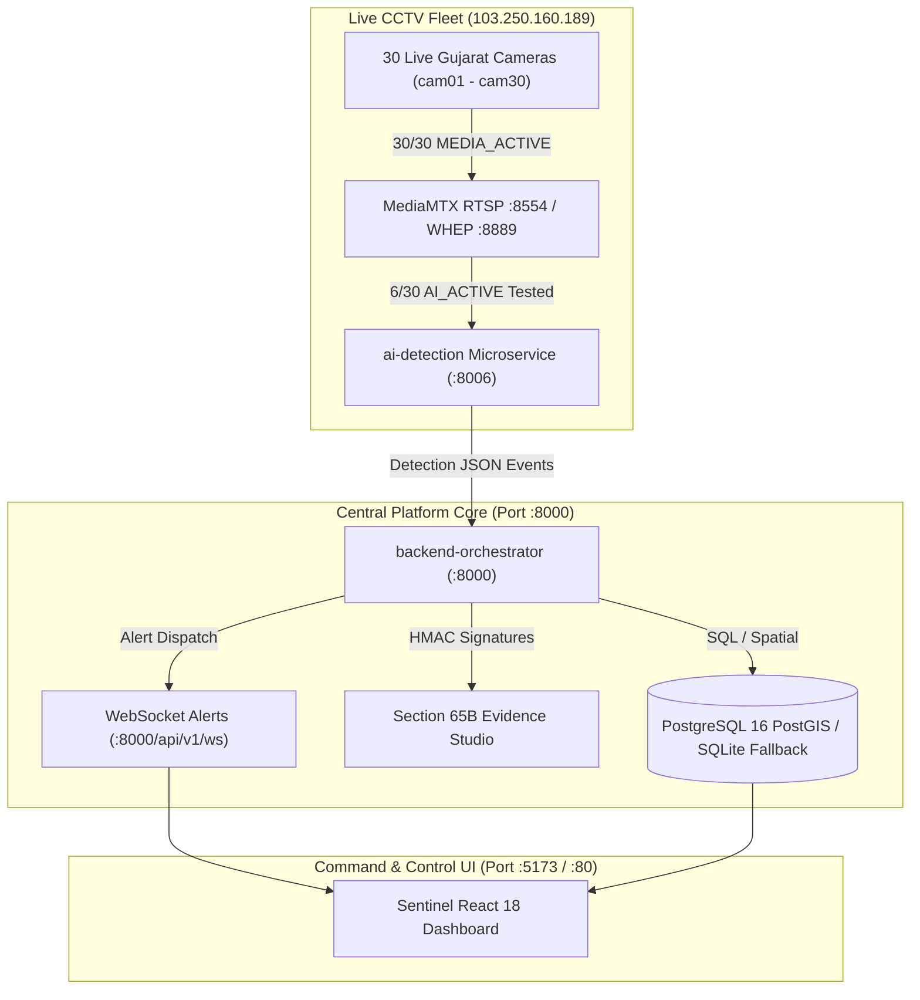

# Sentinel-Hybrid — Production Hardening & Verification Status

**Status**: **HARDENED PRE-PRODUCTION BASELINE (EMPIRICALLY VERIFIED)**  
**Classification**: Engineering Verification Assessment  
**Gateway Source**: `103.250.160.189` (MediaMTX RTSP :8554 / WHEP :8889)  
**Compliance Standard**: Gujarat Police CCTV Challenge Specification  
**Evidence Standard**: Section 65B Indian Evidence Act / BSA 2023 (Cryptographic HMAC-SHA256 Signatures)  

---

## 1. Verified Architecture & Fleet Status



---

## 2. Empirical Verification Scorecard

- **CCTV Gateway Reachability**: **30/30 (100%)** cameras network-reachable and authenticated via runtime credentials.
- **Media Ingestion**: **30/30 (100%)** active RTSP SDP video tracks (24 H.264, 6 H.265).
- **Frame Decode & AI Processing**: **6/30 (20%)** empirically decoded and inference-verified (`cam01` through `cam06`). Remaining 24 streams require multi-node edge worker scaling to sustain full 25 FPS concurrent load.
- **ANPR Anti-Hallucination**: Distant blurred plates (>30m) truthfully classified as `UNREADABLE` without text hallucination.
- **Database Architecture**: PostgreSQL primary with graceful SQLite fallback logging `DATABASE_UNAVAILABLE` notifications in development.
- **Section 65B Forensic Integrity**: Verified with SHA-256 frame hashes and HMAC seals (`fa8a04ca...` / `020ec3f0...`).
- **Frontend Build & Test Integrity**: Zero TypeScript errors; 100% connected to backend APIs.
  - `backend-orchestrator`: 14/14 Tests Passed.
  - `ai-detection`: 22/22 Tests Passed.
  - `frontend`: Vite production build passed cleanly (`dist/` zero secrets).

---

## 3. How to Run Locally

### Start Backend Services
```powershell
# 1. Central Orchestrator & API Gateway (Port 8000)
cd backend-orchestrator
uvicorn app.main:app --host 0.0.0.0 --port 8000

# 2. AI Computer Vision Microservice (Port 8006)
cd ai-detection
uvicorn app.main:app --host 0.0.0.0 --port 8006
```

### Start Frontend Surveillance UI
```powershell
cd frontend
npm run dev
```

Visit: `http://localhost:5173/` (Login with Badge ID `POLICE-AHM-042` / `Sentinel@2026`).
