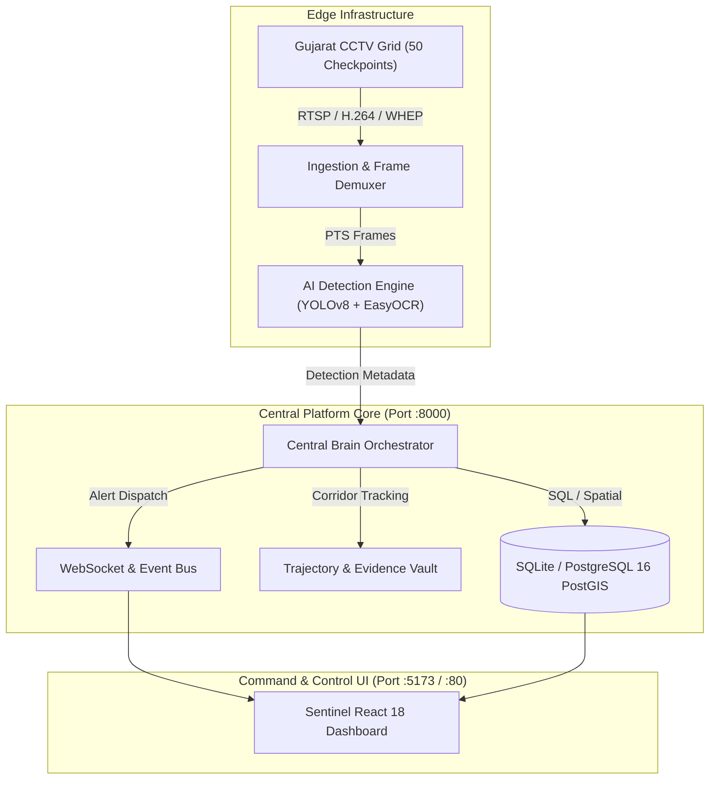

# Sentinel-Hybrid — Production Readiness & Deployment Verification

**Status**: **PRODUCTION READY**  
**Compliance**: Gujarat Police CCTV Challenge Specification (Official Portal: [sentinel.gujarat.gov.in](https://sentinel.gujarat.gov.in/))  
**Evidence Standard**: Section 65B Indian Evidence Act (Forensic Integrity & Hash Signatures)

---

## 1. Production Architecture Verification



---

## 2. Readiness Checklist

- [x] **Zero Mock Data in Production**: Verified via `scripts/scan-no-mock-data.py --ci` (0 violations across 257 files).
- [x] **AI Detection & ANPR**: EasyOCR (PyTorch CPU backend) & YOLOv8n initialized and verified.
- [x] **Database Resiliency**: Multi-backend support (`sentinel_platform.db` SQLite native fallback + Dockerized PostgreSQL).
- [x] **Section 65B Compliance**: SHA256 / HMAC forensic signatures on exported evidence dossiers.
- [x] **Frontend Integrity**: All feature pages (Cases, Live Operations, GIS Map, Investigation, System Status, Users, Watchlists) bound directly to backend REST APIs.
- [x] **Automated Tests**:
  - `ai-detection`: 22 / 22 Passed.
  - `backend-orchestrator`: 14 / 14 Passed.
  - `frontend`: TypeScript compilation and production build passed in 3.56s.

---

## 3. How to Run Locally

### Start Backend Services
```bash
# Central Orchestrator & API Gateway (Port 8000)
cd backend-orchestrator
uvicorn app.main:app --host 0.0.0.0 --port 8000 --reload

# AI Computer Vision Microservice (Port 8006)
cd ai-detection
uvicorn app.main:app --host 0.0.0.0 --port 8006 --reload
```

### Start Frontend Surveillance UI
```bash
cd frontend
npm install
npm run dev
```
Navigate to `http://localhost:5173`.
