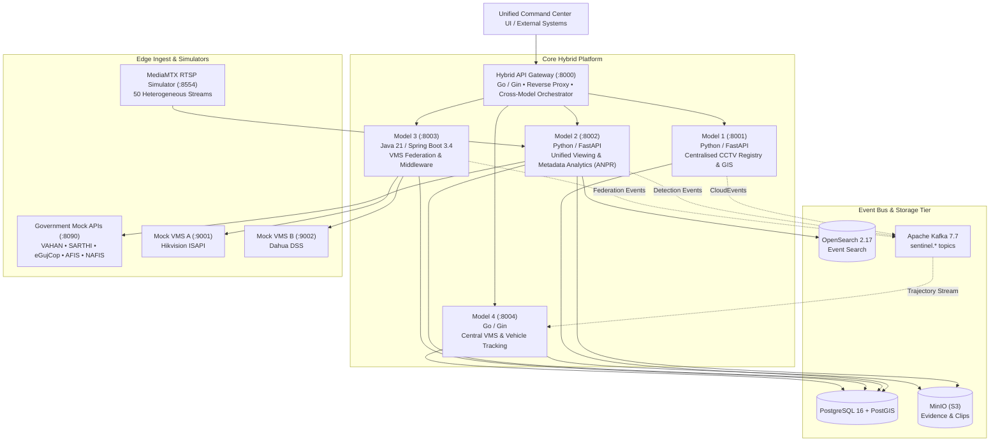

# Gujarat Sentinel — Hybrid CCTV Surveillance & ANPR Platform

[](infra/helm/)
[](#architecture)
[](infra/grafana/)
[](#key-features)

> A secure, vendor-neutral, modular, and horizontally scalable hybrid CCTV video surveillance platform engineered for State Police and Safe City initiatives (modeled on Gujarat Sentinel).

---

## 🏛️ System Architecture



---

## 🚀 Models Breakdown

| Model | Purpose | Tech Stack | Key Capabilities | Port |
|---|---|---|---|---|
| **Model 1** | **CCTV Registry & GIS** | Python 3.12, FastAPI, PostGIS, OPA, OIDC | Camera metadata catalog, PostGIS spatial radius queries (`ST_DWithin`), coverage gap heatmaps, department RBAC, background health poller. | `:8001` |
| **Model 2** | **Unified Viewing & ANPR** | Python 3.12, FastAPI, PyAV, YOLOv8n, PaddleOCR, OpenSearch | RTSP TCP consumers, PTS-based timing, exponential backoff (5s→60s), YOLO vehicle detection + PaddleOCR plate recognition, VAHAN/eGujCop watchlist matching, OpenSearch full-text search. | `:8002` |
| **Model 3** | **VMS Federation** | Java 21, Spring Boot 3.4, Flyway, WebFlux | Strategy adapter pattern for legacy & proprietary VMS (Hikvision ISAPI, Dahua DSS, ONVIF), PTZ control, camera auto-discovery, scheduled health monitors. | `:8003` |
| **Model 4** | **Central VMS & Tracking** | Go 1.23, Gin, pgx/v5, Kafka, S3 | Real-time Kafka consumer aggregating detections into multi-camera vehicle trajectories, encounter correlation, video clip extraction & S3 archiving. | `:8004` |
| **Hybrid Gateway** | **Gateway & Orchestrator** | Go 1.23, Gin, Prometheus, OTel | Unified reverse proxy with cross-model aggregation (`/api/v1/orchestrate/vehicle/:plate`, `/api/v1/orchestrate/camera/:id`, `/api/v1/orchestrate/platform/summary`). | `:8000` |

---

## ⚡ Quickstart & Local Deployment

### Prerequisites
- Docker & Docker Compose (v2.20+)
- Python 3.11+ (for running evaluation scripts)
- Make

### 1. Start the Complete Stack
```bash
# Clone and prepare environment
cp .env.example .env

# Launch all 20+ infrastructure and model containers
docker compose up -d
```

### 2. Verify System Health
```bash
make health
# Or run direct query:
curl -s http://localhost:8000/ready | jq .
```

### 3. Seed Cameras & Watchlist
```bash
python scripts/seed/seed_cameras.py
```

### 4. Run End-to-End Evaluation Scenario
```bash
python scripts/demo/hackathon_scenario.py --plate "GJ 01 AB 1234"
```

---

## 🌐 Endpoints & Dashboards

| Service / Interface | URL | Credentials / Notes |
|---|---|---|
| **Hybrid API Gateway** | `http://localhost:8000` | Unified API entry point |
| **Grafana Platform Dashboard** | `http://localhost:3000` | `admin` / `grafana_admin_pass` |
| **OpenSearch Dashboards** | `http://localhost:5601` | Full-text surveillance event exploration |
| **Kafka UI** | `http://localhost:8082` | Real-time Kafka topic inspector |
| **Keycloak IAM** | `http://localhost:8080` | `admin` / `admin_password` (Realm: `sentinel`) |
| **MinIO Storage Console** | `http://localhost:9001` | `minio_access_key` / `minio_secret_key` |
| **Model 1 API Docs** | `http://localhost:8001/docs` | Swagger UI for Camera Registry & GIS |
| **Model 2 API Docs** | `http://localhost:8002/docs` | Swagger UI for Streams & ANPR |
| **Model 3 Swagger** | `http://localhost:8003/swagger-ui.html` | OpenAPI for VMS Federation |
| **Model 4 API Docs** | `http://localhost:8004/health` | Central VMS & Tracking |

---

## ☸️ Production Kubernetes & GitOps

The platform includes production Helm charts and ArgoCD ApplicationSets:

```bash
# Deploy with Helm
helm upgrade --install sentinel-hybrid infra/helm/sentinel-hybrid \
  --namespace sentinel \
  --create-namespace \
  -f infra/helm/sentinel-hybrid/values.yaml

# Apply ArgoCD ApplicationSets for multi-cluster state deployment
kubectl apply -f infra/argocd/applications.yaml
```

---

## 🔒 Security & Compliance
- **Authentication**: Keycloak OpenID Connect (OIDC) with RS256 JWT tokens.
- **Authorization**: Open Policy Agent (OPA) with fine-grained Rego policies enforcing department-level camera isolation.
- **Auditing**: Tamper-evident immutable audit logs on every GIS and camera operation published to `sentinel.audit.events`.
