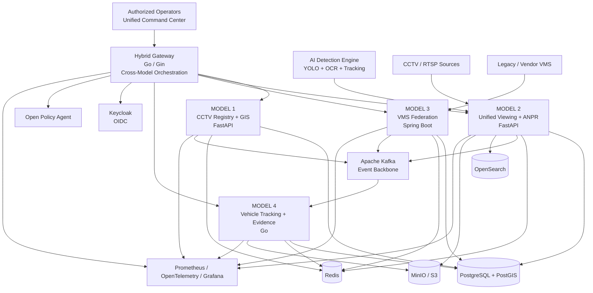
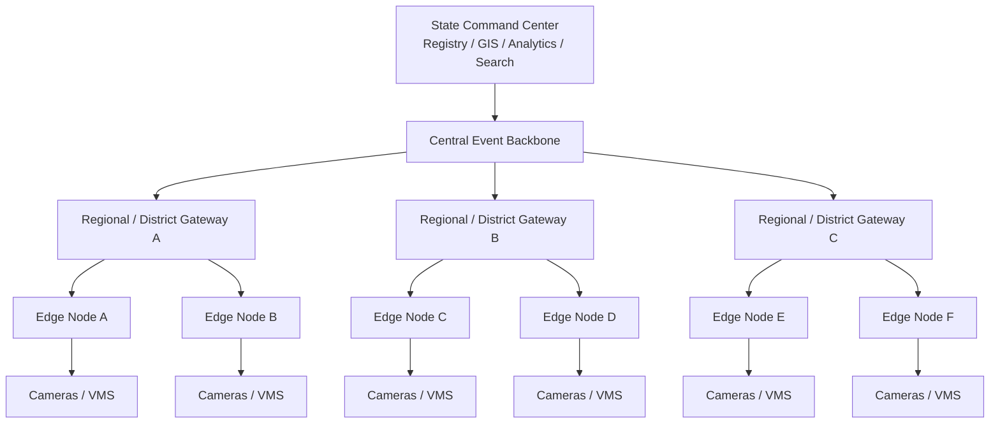

<div align="center">

```text
███████╗███████╗███╗   ██╗████████╗██╗███╗   ██╗███████╗██╗     
██╔════╝██╔════╝████╗  ██║╚══██╔══╝██║████╗  ██║██╔════╝██║     
███████╗█████╗  ██╔██╗ ██║   ██║   ██║██╔██╗ ██║█████╗  ██║     
╚════██║██╔══╝  ██║╚██╗██║   ██║   ██║██║╚██╗██║██╔══╝  ██║     
███████║███████╗██║ ╚████║   ██║   ██║██║ ╚████║███████╗███████╗
╚══════╝╚══════╝╚═╝  ╚═══╝   ╚═╝   ╚═╝╚═╝  ╚═══╝╚══════╝╚══════╝

██╗  ██╗██╗   ██╗██████╗ ██████╗ ██╗██████╗
██║  ██║╚██╗ ██╔╝██╔══██╗██╔══██╗██║██╔══██╗
███████║ ╚████╔╝ ██████╔╝██████╔╝██║██║  ██║
██╔══██║  ╚██╔╝  ██╔══██╗██╔══██╗██║██║  ██║
██║  ██║   ██║   ██████╔╝██║  ██║██║██████╔╝
╚═╝  ╚═╝   ╚═╝   ╚═════╝ ╚═╝  ╚═╝╚═╝╚═════╝
```

# SENTINEL HYBRID

### Hybrid CCTV Integration, VMS Federation, AI Analytics and Situational Intelligence Platform

```text
+==============================================================================+
|                                                                              |
|   REGISTRY  |  GIS  |  VMS FEDERATION  |  AI / ANPR  |  TRACKING           |
|                                                                              |
|   KAFKA  |  POSTGRESQL  |  OPENSEARCH  |  MINIO  |  OIDC  |  OPA          |
|                                                                              |
|                 HYBRID CCTV INTEGRATION & INTELLIGENCE                      |
|                                                                              |
+==============================================================================+
```

</div>

```text
┌──────────────────────────────────────────────────────────────────────────────┐
│ SENTINEL-HYBRID // CENTRAL COMMAND TERMINAL                                │
├──────────────────────────────────────────────────────────────────────────────┤
│                                                                              │
│  root@sentinel:~$ ./sentinel --status                                      │
│                                                                              │
│  [ OK ] MODEL-1        REGISTRY / GIS                                      │
│  [ OK ] MODEL-2        VIDEO / ANPR                                        │
│  [ OK ] MODEL-3        VMS FEDERATION                                      │
│  [ OK ] MODEL-4        VEHICLE TRACKING                                    │
│  [ OK ] HYBRID-GW      CROSS-MODEL ORCHESTRATION                           │
│  [ OK ] AI-ENGINE      DETECTION / OCR / TRACKING                          │
│  [ OK ] KAFKA          EVENT BACKBONE                                     │
│  [ OK ] POSTGRES       SYSTEM OF RECORD                                   │
│  [ OK ] OPENSEARCH     EVENT SEARCH                                       │
│  [ OK ] MINIO          EVIDENCE STORAGE                                   │
│  [ OK ] OTEL           TELEMETRY                                          │
│                                                                              │
│  MODE       : HYBRID                                                       │
│  TOPOLOGY   : EDGE / REGIONAL / CENTRAL                                    │
│  INTEGRATION: MULTI-VMS / MULTI-PROTOCOL                                  │
│  PIPELINE   : VIDEO -> AI -> EVENT -> CORRELATION -> ACTION                │
│                                                                              │
│  root@sentinel:~$ _                                                        │
│                                                                              │
└──────────────────────────────────────────────────────────────────────────────┘
```

> **Integrate existing infrastructure. Keep raw video close to the source. Centralize metadata, events and intelligence.**

---

# 1. Overview

**Sentinel Hybrid** is a modular CCTV integration and intelligence platform designed around a hybrid interpretation of the Gujarat Sentinel CCTV integration challenge.

The challenge describes four indicative CCTV integration models and explicitly permits participating companies to combine elements from multiple models or propose an innovative architecture, provided the solution addresses functional, interoperability, security, scalability, analytics, and implementation requirements.

Sentinel Hybrid uses that flexibility to combine:

```text
Model 1
Centralized CCTV Registry + GIS
        +
Model 2
Unified Viewing + Metadata / ANPR Analytics
        +
Model 3
VMS Federation + Middleware
        +
Model 4
Central Vehicle Tracking + Evidence
        +
Hybrid Gateway / Orchestration
```

The result is a distributed platform in which existing CCTV and VMS infrastructure can remain operational while Sentinel provides a common integration, event, analytics and command-center layer.

---

# 2. Architecture Philosophy

The core design principle is:

```text
                        EXISTING CCTV / VMS ESTATE
                                     |
                +--------------------+--------------------+
                |                    |                    |
                v                    v                    v
             RTSP                 VMS API              Vendor SDK
                |                    |                    |
                +--------------------+--------------------+
                                     |
                                     v
                            HYBRID INTEGRATION
                                     |
                         +-----------+-----------+
                         |                       |
                         v                       v
                     METADATA                  VIDEO
                         |                       |
                         v                       v
                  CENTRAL EVENT BUS       ON-DEMAND ACCESS
                         |
                         v
                  CENTRAL INTELLIGENCE
                         |
        +----------------+----------------+----------------+
        |                |                |                |
        v                v                v                v
       GIS              ANPR           TRACKING          ALERTS
        |                |                |                |
        +----------------+----------------+----------------+
                                     |
                                     v
                           UNIFIED COMMAND CENTER
```

Sentinel does not require all source systems to behave identically.

Instead:

```text
Vendor-specific implementation
             |
             v
        Adapter / Gateway
             |
             v
       Common Sentinel Model
             |
             v
    Cross-platform intelligence
```

---

# 3. Why Hybrid?

A statewide surveillance environment can contain:

```text
Legacy cameras
Modern IP cameras
Multiple VMS vendors
Existing NVR infrastructure
Department-specific systems
Different network segments
Different retention policies
Different analytics capabilities
Different APIs / protocols
```

A single migration strategy would create unnecessary cost, operational risk and dependency on one technology stack.

Sentinel therefore separates:

```text
WHAT ALREADY EXISTS
        |
        v
WHAT MUST BE INTEGRATED
        |
        v
WHAT SHOULD BE CENTRALIZED
```

The architecture keeps local video infrastructure useful while centralizing the information needed for statewide correlation and situational awareness.

---

# 4. System Architecture



---

# 5. Reference Model Mapping

| Reference Model | Sentinel Component | Responsibility |
|---|---|---|
| Model 1 | `backend-model1` | Camera registry, GIS and spatial operations |
| Model 2 | `backend-model2` | Unified viewing, video processing and ANPR |
| Model 3 | `backend-model3` | Multi-vendor VMS federation |
| Model 4 | `backend-model4` | Vehicle trajectory, correlation and evidence |
| Hybrid Layer | `backend-hybrid` | Gateway and cross-model orchestration |
| Orchestration Layer | `backend-orchestrator` | Higher-level workflow coordination |
| AI Layer | `ai-detection` | Detection, OCR and tracking |
| User Interface | `frontend` | Unified command center |
| Contracts | `contracts` | API / protocol contracts |

---

# 6. Model 1 — CCTV Registry & GIS

```text
+-------------------------------------------------------------------+
| MODEL 1                                                           |
| CENTRALIZED CCTV REGISTRY & GIS                                  |
+-------------------------------------------------------------------+
|                                                                   |
| Camera Metadata                                                   |
| Department / Ownership                                            |
| Geographic Coordinates                                            |
| Connectivity                                                      |
| Camera Type                                                       |
| Operational State                                                 |
| Health Monitoring                                                 |
| Spatial Search                                                    |
| Coverage Analysis                                                 |
| Department-level Access Control                                   |
|                                                                   |
+-------------------------------------------------------------------+
```

Implementation:

```text
backend-model1/
```

Technology:

```text
Python 3.12
FastAPI
PostgreSQL
PostGIS
Redis
Pydantic
```

Default API:

```text
http://localhost:8001
```

API documentation:

```text
http://localhost:8001/docs
```

The registry is the common foundation for camera identity and geographic intelligence.

---

# 7. Spatial Intelligence

The GIS layer uses PostGIS-backed spatial operations for tasks such as:

```text
Camera proximity
Coverage analysis
Incident localization
Nearby-camera discovery
Regional filtering
Spatial correlation
```

Conceptual query:

```sql
SELECT *
FROM cameras
WHERE ST_DWithin(
    location,
    reference_point,
    radius
);
```

The architectural goal is to make cameras first-class spatial entities rather than simple records attached to a video URL.

---

# 8. Model 2 — Unified Viewing & ANPR

```text
+-------------------------------------------------------------------+
| MODEL 2                                                           |
| UNIFIED VIEWING + METADATA ANALYTICS                              |
+-------------------------------------------------------------------+
|                                                                   |
| RTSP ingestion                                                    |
| PTS-aware processing                                              |
| Vehicle detection                                                 |
| License plate detection                                           |
| OCR                                                               |
| ANPR event generation                                              |
| Plate normalization                                               |
| Watchlist matching                                                |
| Search / event indexing                                           |
| Stream access                                                     |
|                                                                   |
+-------------------------------------------------------------------+
```

Implementation:

```text
backend-model2/
```

Technology:

```text
Python 3.12
FastAPI
PyAV
YOLO
OCR
OpenSearch
Kafka
PostgreSQL
Redis
```

Default API:

```text
http://localhost:8002
```

API documentation:

```text
http://localhost:8002/docs
```

---

# 9. Video Processing Pipeline

```text
                   RTSP STREAM
                        |
                        v
                 +--------------+
                 | Frame Demux  |
                 +------+-------+
                        |
                        v
                 +--------------+
                 | PTS Handling |
                 +------+-------+
                        |
                        v
                 +--------------+
                 | Frame Decode |
                 +------+-------+
                        |
                        v
                 +--------------+
                 | AI Detection |
                 +------+-------+
                        |
            +-----------+-----------+
            |                       |
            v                       v
        Vehicle                  Plate
        Detection               Detection
            |                       |
            +-----------+-----------+
                        |
                        v
                     OCR
                        |
                        v
               Plate Normalization
                        |
                        v
                 Intelligence
                        |
                        v
                    Event
                        |
                        v
                     Kafka
```

---

# 10. PTS-Aware Processing

For surveillance analytics, media presentation timestamps are more reliable than network arrival timing.

Conceptually:

```text
Frame A
PTS = 1000 ms

Frame B
PTS = 1050 ms

Delta
= 50 ms
```

rather than:

```text
Packet Arrival A
Packet Arrival B
       |
       X
Do not derive video time from arrival jitter.
```

This is especially important for:

```text
Trajectory timing
Velocity estimation
Cross-camera correlation
Event ordering
```

---

# 11. ANPR Processing

Sentinel's AI path is designed around:

```text
Vehicle Detection
        |
        v
Object Tracking
        |
        v
Plate Detection
        |
        v
OCR
        |
        v
Normalization
        |
        v
Watchlist / Intelligence
        |
        v
Event Generation
```

Normalization is useful for equivalent representations such as:

```text
GJ01AB1234
GJ 01 AB 1234
GJ-01-AB-1234
```

which should not become unrelated vehicle identities merely because formatting differs.

---

# 12. AI Detection Engine

Implementation:

```text
ai-detection/
```

The service contains:

```text
detectors/
ocr/
utils/
models/
scripts/
tests/
```

The documented AI stack includes:

```text
YOLO-based object detection
Vehicle detection
Person detection
License-plate detection
OCR
Tracking
ANPR
```

The AI subsystem is separated from the rest of the architecture so that inference logic can evolve without restructuring the federation and registry layers.

---

# 13. Model 3 — VMS Federation

```text
+-------------------------------------------------------------------+
| MODEL 3                                                           |
| VMS FEDERATION & MIDDLEWARE                                       |
+-------------------------------------------------------------------+
|                                                                   |
| Vendor adapters                                                   |
| Camera discovery                                                  |
| VMS discovery                                                     |
| PTZ operations                                                    |
| Health monitoring                                                 |
| Legacy VMS interoperability                                      |
| Proprietary API abstraction                                       |
| Normalized federation interface                                  |
|                                                                   |
+-------------------------------------------------------------------+
```

Implementation:

```text
backend-model3/
```

Technology:

```text
Java 21
Spring Boot
Spring WebFlux
Flyway
PostgreSQL
Kafka
Redis
```

Default API:

```text
http://localhost:8003
```

Swagger:

```text
http://localhost:8003/swagger-ui
```

---

# 14. VMS Adapter Architecture

```text
                     COMMON VMS INTERFACE
                              |
             +----------------+----------------+
             |                |                |
             v                v                v
       Hikvision           Dahua             ONVIF
        Adapter            Adapter           Adapter
             |                |                |
             +----------------+----------------+
                              |
                              v
                       Federation Layer
```

The current Model 3 source tree contains a dedicated adapter layer and vendor adapters for:

```text
Hikvision
Dahua
VMS abstraction
```

The design makes it possible to add future vendors without rewriting the command-center application.

---

# 15. Vendor-Neutral Federation

The target architecture is:

```text
Vendor Protocol
      |
      v
Vendor Adapter
      |
      v
Normalized Camera / VMS Interface
      |
      +--> Discovery
      +--> Health
      +--> PTZ
      +--> Camera Metadata
      +--> Events
      |
      v
Sentinel
```

This is the core mechanism for integrating heterogeneous CCTV estates.

---

# 16. Model 4 — Vehicle Tracking & Evidence

```text
+-------------------------------------------------------------------+
| MODEL 4                                                           |
| CENTRAL VEHICLE TRACKING                                          |
+-------------------------------------------------------------------+
|                                                                   |
| Kafka detection consumer                                          |
| Multi-camera trajectory aggregation                               |
| Encounter correlation                                             |
| Vehicle movement timelines                                        |
| Event correlation                                                 |
| Clip extraction                                                   |
| Evidence archival                                                 |
| S3-compatible object storage                                     |
|                                                                   |
+-------------------------------------------------------------------+
```

Implementation:

```text
backend-model4/
```

Technology:

```text
Go 1.23
Gin
pgx/v5
Apache Kafka
MinIO / S3
OpenTelemetry
```

Default service:

```text
http://localhost:8004
```

Health:

```text
http://localhost:8004/health
```

---

# 17. Vehicle Correlation Pipeline

```text
                    CAMERA A
                       |
                       v
                  Detection A
                       |
                       |
                    CAMERA B
                       |
                       v
                  Detection B
                       |
                       |
                    CAMERA C
                       |
                       v
                  Detection C
                       |
                       v
                    KAFKA
                       |
                       v
              +------------------+
              | Tracking Engine  |
              +--------+---------+
                       |
            +----------+----------+
            |                     |
            v                     v
       Trajectory             Encounter
       Correlation            Correlation
            |                     |
            +----------+----------+
                       |
                       v
                  Vehicle Timeline
                       |
                       v
                Evidence / Clip
                       |
                       v
                   MinIO / S3
```

A detection is therefore not treated as an isolated event. It can become part of a temporal, cross-camera vehicle history.

---

# 18. Hybrid Gateway

Implementation:

```text
backend-hybrid/
```

Technology:

```text
Go
Gin
Prometheus
OpenTelemetry
Reverse Proxy
Cross-Model Aggregation
```

Default:

```text
http://localhost:8000
```

The gateway provides a unified entry point for the command center and external systems.

Documented aggregation patterns include:

```text
/api/v1/orchestrate/vehicle/:plate
/api/v1/orchestrate/camera/:id
/api/v1/orchestrate/platform/summary
```

Conceptually:

```text
                           REQUEST
                              |
                              v
                    +--------------------+
                    |  HYBRID GATEWAY    |
                    +---------+----------+
                              |
            +-----------------+-----------------+
            |                 |                 |
            v                 v                 v
          Model 1           Model 2           Model 3
            |                 |                 |
            +-----------------+-----------------+
                              |
                              v
                            Model 4
                              |
                              v
                     Aggregated Response
```

---

# 19. Backend Orchestrator

Implementation:

```text
backend-orchestrator/
```

The orchestrator separates higher-level workflow logic from the low-level gateway function.

Structure:

```text
adapters/
api/
core/
models/
schemas/
services/
scripts/
tests/
```

This enables workflows that may involve multiple services without embedding all cross-service logic into one backend.

---

# 20. Event Backbone

Apache Kafka acts as the asynchronous event backbone.

```text
                  +------------------+
                  |     Model 1      |
                  +--------+---------+
                           |
                           v
                    +-------------+
                    |             |
                    |    KAFKA    |
                    |             |
                    +------+------+
                           |
            +--------------+--------------+
            |              |              |
            v              v              v
         Model 4        Search         Alerts
```

Kafka provides:

```text
Asynchronous processing
Cross-model decoupling
Independent consumers
Event fan-out
High-throughput pipelines
Future extensibility
```

The repository's HLD uses Kafka for CloudEvents-style and model-to-model event exchange.

---

# 21. Event-Driven Data Flow

```text
SOURCE
   |
   v
INGESTION
   |
   v
NORMALIZATION
   |
   v
PROCESSING
   |
   v
EVENT
   |
   v
KAFKA
   |
   +----------+-------------+-------------+
   |          |             |             |
   v          v             v             v
 SEARCH     TRACKING      ALERTING      STORAGE
```

This design allows consumers to evolve independently from producers.

---

# 22. Storage Architecture

```text
+----------------------+---------------------------------------------+
| Storage              | Responsibility                               |
+----------------------+---------------------------------------------+
| PostgreSQL           | Transactional platform state                 |
| PostGIS              | Geographic / spatial information             |
| OpenSearch           | Event / text search                          |
| MinIO / S3           | Evidence, clips and object storage           |
| Redis                | Cache / ephemeral state                       |
| Kafka                | Event transport                              |
+----------------------+---------------------------------------------+
```

---

# 23. PostgreSQL + PostGIS

Used for:

```text
Camera registry
Department metadata
Structured application state
Spatial queries
Relationships
Operational records
```

PostGIS extends the system with:

```text
Spatial indexes
Radius search
Geographic filtering
Coverage analysis
```

---

# 24. OpenSearch

Used for event-oriented workloads:

```text
ANPR events
Camera events
Detection metadata
Historical search
Text search
Time-based investigation
```

Conceptual pipeline:

```text
Detection Event
      |
      v
Normalization
      |
      v
OpenSearch Index
      |
      +--> Plate Search
      +--> Camera Search
      +--> Time Search
      +--> Event Search
```

---

# 25. MinIO / S3 Evidence Layer

Evidence and extracted video clips use object storage.

```text
                 VIDEO / EVENT
                      |
                      v
                Clip Extraction
                      |
                      v
                    Hash
                      |
                      v
               Evidence Metadata
                      |
                      v
                  MinIO / S3
```

This separates large binary artifacts from transactional application data.

---

# 26. Evidence Integrity

The documented evidence architecture includes concepts such as:

```text
SHA-256 hashing
HMAC / cryptographic integrity
Timestamping
Operator identity
Evidence metadata
Verification
Audit trail
```

A conceptual chain is:

```text
Evidence
   |
   v
SHA-256
   |
   v
Integrity Metadata
   |
   v
Audit Event
   |
   v
Verification
```

For actual deployment, evidence policies, chain-of-custody controls, retention, and cryptographic key management must be independently validated against the target operational environment.

---

# 27. Government / Reference Integrations

Sentinel provides an adapter-oriented architecture for external reference systems.

The documented integration direction includes:

```text
VAHAN
SARTHI
eGujCop
AFIS
NAFIS
```

Conceptually:

```text
                       ANPR
                        |
                        v
                 Normalized Plate
                        |
             +----------+----------+
             |          |          |
             v          v          v
           VAHAN      eGujCop    SARTHI
             |          |          |
             +----------+----------+
                        |
                        v
                   Intelligence
```

The repository also provides local mock/reference APIs for development and evaluation.

---

# 28. Protocol and Media Interoperability

Sentinel is designed around multiple transport mechanisms.

```text
RTSP
   |
   +--> AI / inference

WebRTC / WHEP
   |
   +--> Low-latency browser viewing

HLS
   |
   +--> Dashboard / compatibility path

ONVIF
   |
   +--> Discovery / interoperability

Vendor APIs
   |
   +--> Federation
```

The project intentionally separates:

```text
Video Transport
Control Protocol
Event Protocol
Data API
```

rather than treating all interfaces as the same thing.

---

# 29. Realtime Video Architecture

```text
Camera / VMS
     |
     v
 RTSP Source
     |
     v
 Ingestion
     |
     +------------------+
     |                  |
     v                  v
AI Pipeline          Browser Relay
     |                  |
     v                  v
Events              WebRTC / HLS
     |
     v
Kafka
```

This supports a model in which analytics and visualization can consume the same operational source without forcing every consumer to directly speak the original camera protocol.

---

# 30. Reconnect and Failure Handling

A distributed video environment must expect intermittent failures.

The documented architecture accounts for:

```text
Network interruption
RTSP disconnects
Decode failures
Slow sources
Unavailable VMS
Temporary service failures
External API failures
Kafka interruption
```

The stream-processing design uses reconnect/backoff behavior rather than treating every temporary media failure as a fatal system error.

Conceptually:

```text
CONNECT
   |
   +---- SUCCESS ----> RUNNING
   |
   +---- FAILURE
          |
          v
        BACKOFF
          |
          v
         RETRY
          |
     +----+----+
     |         |
 success     failure
     |         |
     v         v
 RUNNING     BACKOFF
```

---

# 31. Dynamic Camera Catalogue

The platform is designed to discover and ingest camera metadata dynamically.

```text
Camera Catalogue
       |
       v
Schema Validation
       |
       v
Registry
       |
       v
Health Polling
       |
       v
Stream Availability
       |
       v
Analytics / Viewing
```

This avoids hardcoding the entire surveillance estate into the application.

---

# 32. AI Pipeline


---

# 33. Cross-Camera Intelligence

A complete surveillance intelligence workflow is therefore:

```text
Camera 01
   |
   v
Detection
   |
   v
Plate / Vehicle Identity
   |
   v
Event

Camera 02
   |
   v
Detection
   |
   v
Plate / Vehicle Identity
   |
   v
Event

Camera 03
   |
   v
Detection
   |
   v
Plate / Vehicle Identity
   |
   v
Event

             ALL EVENTS
                 |
                 v
              KAFKA
                 |
                 v
        CROSS-CAMERA CORRELATION
                 |
                 v
             TRAJECTORY
                 |
                 v
           INVESTIGATION
```

---

# 34. Unified Command Center

The `frontend/` application provides the operator-facing system.

The frontend is structured around:

```text
app/
components/
core/
domains/
features/
services/
shared/
stores/
types/
```

The documented application surface includes workflows for:

```text
Dashboard
Vulnerabilities / events
Findings
Finding details
Assets
Risk
Threat intelligence
Remediation
Integrations
Analytics
Reports
Audit
Training
Training runs
```

The frontend uses:

```text
React
TypeScript
Vite
React Router
TanStack Query
Zustand
Framer Motion
HLS.js
Leaflet
Recharts
Lucide React
```

---

# 35. Command Center Concept

```text
┌──────────────────────────────────────────────────────────────────────────────┐
│ SENTINEL // COMMAND CENTER                               STATUS: OPERATIONAL │
├──────────────────────────────────────────────────────────────────────────────┤
│                                                                              │
│  ALERTS             TACTICAL GIS                    SYSTEM TELEMETRY         │
│  ---------          ----------------                ----------------         │
│  APB                Camera Network                 Kafka                     │
│  WATCHLIST          Camera Health                  PostgreSQL                │
│  INCIDENT           Incident Location              OpenSearch               │
│                     Coverage                       MinIO                    │
│                                                                              │
│  ┌────────────────────────────────────────────────────────────────────────┐  │
│  │                            LIVE VIDEO                                  │  │
│  │                                                                        │  │
│  │      CAM-001       CAM-002       CAM-003       CAM-004                 │  │
│  │                                                                        │  │
│  └────────────────────────────────────────────────────────────────────────┘  │
│                                                                              │
│  VEHICLE TIMELINE             EVENT STREAM              INCIDENT DETAILS     │
│                                                                              │
└──────────────────────────────────────────────────────────────────────────────┘
```

---

# 36. GIS Command Surface

The GIS layer can provide:

```text
Camera locations
Camera status
Department ownership
Coverage
Nearby cameras
Incident coordinates
Spatial filtering
Operational overlays
```

Conceptually:

```text
                    INCIDENT
                       |
                       v
                  Coordinates
                       |
                       v
                +-------------+
                |   PostGIS   |
                +------+------+
                       |
             +---------+---------+
             |         |         |
             v         v         v
          Cameras   Coverage   Regions
```

---

# 37. Realtime Event Surface

The command center can subscribe to operational events instead of periodically polling every service.

```text
Kafka
  |
  +--> Gateway
  |
  +--> Tracking
  |
  +--> Search
  |
  +--> Alerting
  |
  +--> Analytics
  |
  +--> Realtime UI
```

This creates a more responsive operational architecture.

---

# 38. Authentication and Authorization

The target security architecture uses:

```text
Keycloak
    |
    v
OpenID Connect
    |
    v
JWT / RS256
    |
    v
Gateway
    |
    v
OPA
    |
    v
Policy Decision
    |
    v
Authorized Resource
```

Authorization is intended to support:

```text
Role-based access
Department-level isolation
Camera-level permissions
Administrative privileges
Operator accountability
Auditability
```

---

# 39. Policy-as-Code

Open Policy Agent provides centralized authorization policy.

Conceptually:

```text
Request
   |
   +--> Identity
   +--> Role
   +--> Department
   +--> Resource
   +--> Action
          |
          v
       OPA / Rego
          |
     +----+----+
     |         |
   ALLOW      DENY
```

This keeps authorization logic separate from individual application controllers.

---

# 40. Auditability

Security-sensitive operations should produce an audit event.

```text
Operator Action
      |
      v
Authentication
      |
      v
Authorization
      |
      v
Business Operation
      |
      +----------------------+
      |                      |
      v                      v
 State Change             Audit Event
                              |
                              v
                         Audit Stream
```

The documented architecture includes audit events routed through the event backbone.

---

# 41. Observability

Sentinel separates observability from application functionality.

```text
                 APPLICATIONS
                      |
        +-------------+-------------+
        |             |             |
        v             v             v
      METRICS       TRACES         LOGS
        |             |             |
        v             v             v
   Prometheus      OTel        Structured Logs
        |             |
        +------+------+
               |
               v
            Grafana
```

The documented stack includes:

```text
Prometheus
OpenTelemetry
Grafana
```

---

# 42. Operational Metrics

Examples of useful platform metrics:

```text
Gateway latency
API error rate
Active cameras
Healthy cameras
Offline cameras
Kafka throughput
Event processing latency
ANPR throughput
OCR confidence
Tracking throughput
Database connections
Search latency
Object-storage operations
Service availability
```

The objective is to make failures observable before they become operator-visible incidents.

---

# 43. Statewide Scalability

The platform is designed around a principle of **metadata/event centralization rather than indiscriminate raw-video centralization**.

```text
                  STATE LEVEL
                      |
          +-----------+-----------+
          |                       |
          v                       v
      Registry                 Analytics
          |                       |
          +-----------+-----------+
                      |
                    Kafka
                      |
        +-------------+-------------+
        |             |             |
        v             v             v
     Region A      Region B      Region C
        |             |             |
        v             v             v
      Edge          Edge          Edge
        |             |             |
      Cameras       Cameras       Cameras
```

The documented HLD identifies an 80,000-camera scale target and uses edge/regional/central processing to avoid requiring all raw streams to traverse the central network continuously.

---

# 44. Why Not Centralize Every Video Stream?

If every camera permanently sends high-bitrate raw video to one central location:

```text
80,000 Cameras
      |
      v
Massive Central Bandwidth
      |
      v
Higher Cost
      |
      v
Central Bottleneck
      |
      v
Higher Failure Impact
```

The hybrid approach instead favors:

```text
VIDEO
-----
Keep near source whenever practical.


METADATA
--------
Centralize.


EVENTS
------
Centralize.


ALERTS
------
Centralize.


EVIDENCE
--------
Store according to operational policy.


LIVE VIDEO
----------
Retrieve when needed.
```

This is one of the most important architectural advantages of the hybrid model.

---

# 45. Edge / Regional / Central Topology



---

# 46. Local Demonstration Environment

The repository includes simulators and mock services so the platform can be evaluated without access to a real government CCTV estate.

```text
simulators/
    |
    +--> RTSP camera simulation

Mock APIs
    |
    +--> Government integration simulation

Mock VMS A
    |
    +--> Hikvision-style integration

Mock VMS B
    |
    +--> Dahua-style integration
```

This makes the architecture reproducible for:

```text
Development
Testing
Hackathon demonstration
Integration validation
Evaluation
```

---

# 47. RTSP Simulator

The current Docker Compose configuration provides a MediaMTX-based synthetic camera environment.

Documented default behavior includes:

```text
50 heterogeneous streams
RTSP
WebRTC / WHEP
HLS
```

This allows the AI and viewing pipelines to be tested without physical cameras.

---

# 48. Mock VMS

Two mock VMS environments are included:

```text
Mock VMS A
Hikvision-style
:9001

Mock VMS B
Dahua-style
:9002
```

The purpose is to test the vendor-adapter architecture against more than one VMS model.

---

# 49. Mock Government APIs

The Docker environment includes a mock API surface for reference integrations.

```text
http://localhost:8090
```

The documented reference domains include:

```text
VAHAN
SARTHI
eGujCop
AFIS
NAFIS
```

These are local development integrations and should not be mistaken for live government connectivity.

---

# 50. Docker Architecture

```text
┌────────────────────────────────────────────────────────────────────────────┐
│                         DOCKER COMPOSE STACK                              │
├────────────────────────────────────────────────────────────────────────────┤
│                                                                            │
│  Frontend                                                                  │
│     │                                                                      │
│     v                                                                      │
│  Hybrid Gateway                                                            │
│     │                                                                      │
│     ├──────── Model 1                                                      │
│     ├──────── Model 2                                                      │
│     ├──────── Model 3                                                      │
│     └──────── Model 4                                                      │
│                                                                            │
│  AI Detection                                                             │
│                                                                            │
│  PostgreSQL / PostGIS                                                     │
│  Redis                                                                    │
│  Kafka                                                                    │
│  OpenSearch                                                               │
│  MinIO                                                                    │
│  Keycloak                                                                 │
│  OPA                                                                      │
│  Prometheus                                                               │
│  OpenTelemetry                                                            │
│  Grafana                                                                  │
│                                                                            │
│  RTSP Simulator                                                            │
│  Mock APIs                                                                 │
│  Mock VMS A                                                                │
│  Mock VMS B                                                                │
│                                                                            │
└────────────────────────────────────────────────────────────────────────────┘
```

The root `docker-compose.yml` defines the integrated development topology and health/dependency relationships.

---

# 51. Service Ports

| Service | Port | Function |
|---|---:|---|
| Hybrid Gateway | `8000` | Unified API |
| Model 1 | `8001` | Registry / GIS |
| Model 2 | `8002` | Viewing / ANPR |
| Model 3 | `8003` | VMS Federation |
| Model 4 | `8004` | Tracking / Evidence |
| Frontend | `3001` | Command Center |
| Grafana | `3000` | Observability |
| Keycloak | `8080` | Identity |
| OpenSearch | `9200` | Search |
| OpenSearch Dashboards | `5601` | Search UI |
| Kafka UI | `8082` | Kafka inspection |
| MinIO API | `9000` | S3 API |
| MinIO Console | `9005` | Storage console |
| RTSP | `8554` | Video input |
| WebRTC / WHEP | `8889` | Browser video |
| Mock APIs | `8090` | Reference APIs |
| Mock VMS A | `9001` | Hikvision-style VMS |
| Mock VMS B | `9002` | Dahua-style VMS |

---

# 52. Repository Structure

```text
Sentinel-Hybrid/
|
+-- ai-detection/
|   |
|   +-- app/
|   |   +-- detectors/
|   |   +-- ocr/
|   |   +-- utils/
|   |   +-- config.py
|   |   +-- main.py
|   |   +-- schemas.py
|   |
|   +-- models/
|   +-- scripts/
|   +-- tests/
|   +-- Dockerfile
|   +-- requirements.txt
|
+-- backend-hybrid/
|   |
|   +-- cmd/
|   +-- Dockerfile
|   +-- go.mod
|
+-- backend-model1/
|   |
|   +-- app/
|   |   +-- api/
|   |   +-- core/
|   |   +-- db/
|   |   +-- schemas/
|   |   +-- services/
|   |   +-- workers/
|   |
|   +-- tests/
|   +-- Dockerfile
|   +-- pyproject.toml
|
+-- backend-model2/
|   |
|   +-- app/
|   |   +-- api/
|   |   +-- db/
|   |   +-- pipeline/
|   |   +-- schemas/
|   |   +-- services/
|   |   +-- workers/
|   |
|   +-- tests/
|   +-- Dockerfile
|   +-- pyproject.toml
|
+-- backend-model3/
|   |
|   +-- src/
|   |   +-- main/
|   |       +-- java/
|   |           +-- in/
|   |               +-- gujarat/
|   |                   +-- sentinel/
|   |                       +-- model3/
|   |                           +-- adapter/
|   |                           +-- controller/
|   |                           +-- domain/
|   |                           +-- repository/
|   |                           +-- service/
|   |
|   +-- Dockerfile
|   +-- pom.xml
|
+-- backend-model4/
|   |
|   +-- cmd/
|   +-- internal/
|       +-- config/
|       +-- handler/
|       +-- repository/
|       +-- service/
|   |
|   +-- Dockerfile
|   +-- go.mod
|
+-- backend-orchestrator/
|   |
|   +-- app/
|   |   +-- adapters/
|   |   +-- api/
|   |   +-- core/
|   |   +-- models/
|   |   +-- schemas/
|   |   +-- services/
|   |
|   +-- scripts/
|   +-- tests/
|   +-- Dockerfile
|
+-- contracts/
|   |
|   +-- openapi/
|   +-- proto/
|
+-- docs/
|   |
|   +-- case_study/
|   +-- INTEGRATION_REFERENCE.md
|   +-- TECHNICAL_HLD_AND_SUBMISSION_DOSSIER.md
|
+-- evaluation/
|   +-- data/
|
+-- frontend/
|   |
|   +-- src/
|       +-- app/
|       +-- components/
|       +-- core/
|       +-- domains/
|       +-- features/
|       +-- services/
|       +-- shared/
|       +-- stores/
|       +-- types/
|       +-- App.tsx
|       +-- main.tsx
|
+-- infra/
|   |
|   +-- argocd/
|   +-- grafana/
|   +-- helm/
|   +-- opa/
|   +-- otel/
|   +-- prometheus/
|
+-- reports/
|
+-- scripts/
|   |
|   +-- demo/
|   +-- seed/
|   +-- run.py
|
+-- sentinel_evaluator/
|
+-- simulators/
|
+-- tests/
|
+-- .env.example
+-- Makefile
+-- README.md
+-- REAL_DATA_MATRIX.md
+-- RUNNING_THE_PROJECT.md
+-- docker-compose.yml
+-- run.ps1
+-- run.sh
```

---

# 53. Shared Contracts

The repository contains:

```text
contracts/
|
+-- openapi/
+-- proto/
```

These contracts form the boundary between independently implemented services.

```text
Model 1 --------\
Model 2 ---------+
Model 3 ---------+----> Shared Contracts
Model 4 ---------+
Gateway ----------+
Frontend ---------/
```

Benefits:

```text
API stability
Cross-language interoperability
Explicit schemas
Versioning
Generated clients
Reduced implicit coupling
```

---

# 54. Technology Stack

## Model 1

```text
Python 3.12
FastAPI
PostgreSQL
PostGIS
Redis
Pydantic
```

## Model 2

```text
Python 3.12
FastAPI
PyAV
YOLO
OCR
OpenSearch
Kafka
PostgreSQL
Redis
```

## Model 3

```text
Java 21
Spring Boot 3.4
Spring WebFlux
Flyway
PostgreSQL
Kafka
Redis
```

## Model 4

```text
Go 1.23
Gin
pgx/v5
Kafka
MinIO / S3
OpenTelemetry
```

## Hybrid Gateway

```text
Go
Gin
Prometheus
OpenTelemetry
```

## Frontend

```text
React 18
TypeScript
Vite
React Router
TanStack Query
Zustand
Framer Motion
HLS.js
Leaflet
Recharts
Lucide React
```

## Infrastructure

```text
Docker
Docker Compose
PostgreSQL
PostGIS
Redis
Apache Kafka
OpenSearch
MinIO
Keycloak
OPA
Prometheus
OpenTelemetry
Grafana
```

---

# 55. Quick Start

## Prerequisites

```text
Docker
Docker Compose v2.20+
Python 3.11+
Make
Node.js
Git
```

---

## Clone

```bash
git clone https://github.com/Bhargav-2007/Sentinel-Hybrid.git
cd Sentinel-Hybrid
```

---

## Environment

Linux / macOS:

```bash
cp .env.example .env
```

Windows PowerShell:

```powershell
Copy-Item .env.example .env
```

Review the environment before starting the stack.

Do not commit secrets or production credentials.

---

# 56. Start the Full Stack

Using Docker Compose:

```bash
docker compose up -d
```

Or the repository's canonical runner:

```bash
python scripts/run.py --start
```

Or:

```bash
make up
```

Linux/macOS wrapper:

```bash
./run.sh
```

Windows PowerShell:

```powershell
.\run.ps1
```

---

# 57. Health Verification

Run:

```bash
make health
```

or:

```bash
python scripts/run.py --status
```

Then:

```bash
python scripts/run.py --verify
```

Gateway readiness:

```bash
curl -s http://localhost:8000/ready | jq .
```

---

# 58. Seed Cameras

```bash
python scripts/seed/seed_cameras.py
```

This populates development camera data for demonstration and integration workflows.

---

# 59. Demo Scenario

The repository includes a demonstration scenario:

```text
scripts/demo/hackathon_scenario.py
```

Example:

```bash
python scripts/demo/hackathon_scenario.py --plate "GJ 01 AB 1234"
```

A typical conceptual flow is:

```text
Plate
  |
  v
ANPR
  |
  v
External / Mock Intelligence
  |
  v
Kafka
  |
  v
Vehicle Correlation
  |
  v
Trajectory
  |
  v
Command Center
```

---

# 60. Frontend Development

```bash
cd frontend
npm install
npm run dev
```

Default:

```text
http://localhost:3001
```

Build:

```bash
npm run build
```

Preview:

```bash
npm run preview
```

---

# 61. Backend Development

Individual Python services can be run from their corresponding service directories.

For example:

```bash
cd backend-model1
```

Create a virtual environment:

```bash
python -m venv .venv
```

Activate on Linux/macOS:

```bash
source .venv/bin/activate
```

Windows:

```powershell
.venv\Scripts\activate
```

Install dependencies according to the service configuration.

---

# 62. Diagnostics

The canonical runner provides operational commands including:

```bash
python scripts/run.py --doctor
python scripts/run.py --check-ports
python scripts/run.py --status
python scripts/run.py --verify
python scripts/run.py --test
python scripts/run.py --migrate
```

Additional modes include:

```bash
python scripts/run.py --backend-only
python scripts/run.py --frontend-only
python scripts/run.py --ci
```

---

# 63. Make Commands

Common project-level commands include:

```bash
make up
make down
make restart
make status
make health
make doctor
make verify
make logs
make logs-svc SVC=model2
```

---

# 64. Production Kubernetes

The repository includes Kubernetes deployment assets under:

```text
infra/helm/
infra/argocd/
```

Helm:

```bash
helm upgrade --install sentinel-hybrid \
  infra/helm/sentinel-hybrid \
  --namespace sentinel \
  --create-namespace \
  -f infra/helm/sentinel-hybrid/values.yaml
```

Argo CD:

```bash
kubectl apply \
  -f infra/argocd/applications.yaml
```

The target model supports:

```text
Multi-instance services
Regional deployments
Cluster orchestration
GitOps
Horizontal scaling
Infrastructure automation
```

---

# 65. Observability Access

Grafana:

```text
http://localhost:3000
```

Prometheus:

```text
http://localhost:9090
```

OpenSearch:

```text
http://localhost:9200
```

OpenSearch Dashboards:

```text
http://localhost:5601
```

Kafka UI:

```text
http://localhost:8082
```

---

# 66. Identity and Policy

Keycloak:

```text
http://localhost:8080
```

OPA:

```text
http://localhost:8181
```

MinIO:

```text
http://localhost:9000
```

MinIO Console:

```text
http://localhost:9005
```

Development credentials are environment-specific and must not be reused for production deployment.

---

# 67. Development vs Production

This distinction is important.

```text
+-------------------------------------------------------------------+
| DEMONSTRATION                                                     |
+-------------------------------------------------------------------+
| Synthetic cameras                                                 |
| Mock VMS                                                          |
| Mock APIs                                                         |
| Local Docker infrastructure                                       |
| Development credentials                                           |
| Simplified deployment                                             |
+-------------------------------------------------------------------+

                                !=

+-------------------------------------------------------------------+
| PRODUCTION                                                        |
+-------------------------------------------------------------------+
| Real cameras / VMS                                                |
| Real identity                                                     |
| Production policy                                                 |
| TLS / secure transport                                            |
| Secrets management                                                |
| Network segmentation                                              |
| High availability                                                 |
| Backup / disaster recovery                                        |
| Security monitoring                                               |
| Operational governance                                            |
+-------------------------------------------------------------------+
```

The repository's Docker environment is intended to make the architecture reproducible locally; production deployment requires environment-specific hardening and validation.

---

# 68. Security Architecture

```text
                         USER
                           |
                           v
                   +---------------+
                   |   Keycloak    |
                   |    OIDC       |
                   +-------+-------+
                           |
                           v
                   +---------------+
                   | JWT / RS256   |
                   +-------+-------+
                           |
                           v
                   +---------------+
                   | API Gateway   |
                   +-------+-------+
                           |
                           v
                   +---------------+
                   |     OPA       |
                   | Rego Policies |
                   +-------+-------+
                           |
                           v
                   Authorized Action
```

---

# 69. Security Principles

Production deployment should enforce:

```text
Authentication
Authorization
Least privilege
Department isolation
Secure transport
Secret management
Audit logging
Operator accountability
Evidence integrity
Retention policies
Network segmentation
Service-to-service authentication
```

The local environment should never be mistaken for the final security posture.

---

# 70. Privacy and Governance

A government-scale surveillance platform must be deployed with explicit governance.

Relevant concerns include:

```text
Purpose limitation
Data minimization
Access control
Retention
Evidence handling
Operator accountability
Auditability
Data export
Incident response
```

The software architecture can support these controls, but organizational policy and legal requirements remain deployment-specific responsibilities.

---

# 71. Failure Isolation

A distributed architecture should fail gracefully.

```text
Model 3 DOWN
     |
     +--> VMS federation unavailable
     |
     +--> Registry remains available
     +--> Existing analytics remain available
     +--> Other services continue where dependencies permit
```

Similarly:

```text
One Camera DOWN
     |
     +--> Other cameras continue
```

and:

```text
Search unavailable
     |
     +--> Transactional state remains separate
```

The architecture therefore seeks to avoid a single service becoming a universal failure domain.

---

# 72. Service Ownership

```text
MODEL 1
------
Identity of cameras
GIS
Registry
Health
Spatial intelligence


MODEL 2
------
Video ingestion
Viewing
Detection
ANPR
Search


MODEL 3
------
VMS interoperability
Vendor adapters
Discovery
PTZ
Health


MODEL 4
------
Vehicle trajectory
Cross-camera correlation
Evidence
Clip extraction


HYBRID GATEWAY
--------------
Routing
Aggregation
Cross-model requests


ORCHESTRATOR
------------
Workflow coordination
```

---

# 73. Data Lifecycle

```text
CAMERA
  |
  v
DISCOVERY
  |
  v
REGISTRATION
  |
  v
VALIDATION
  |
  v
HEALTH MONITORING
  |
  v
STREAM / VMS INTEGRATION
  |
  v
AI / EVENT PROCESSING
  |
  v
CORRELATION
  |
  v
ALERT / INVESTIGATION
  |
  v
EVIDENCE
  |
  v
RETENTION / ARCHIVAL
```

---

# 74. End-to-End Example

```text
01  Camera is discovered
        |
02  Camera registered in Model 1
        |
03  Health state becomes available
        |
04  Model 2 receives RTSP
        |
05  AI detects a vehicle
        |
06  Tracker assigns an object track
        |
07  Plate region is detected
        |
08  OCR produces plate candidate
        |
09  Plate is normalized
        |
10  Intelligence / watchlist lookup occurs
        |
11  Detection event is published
        |
12  Kafka distributes the event
        |
13  Model 4 consumes the detection
        |
14  Cross-camera correlation updates trajectory
        |
15  Gateway aggregates the result
        |
16  Command center presents the investigation
        |
17  Operator requests live video
        |
18  Evidence clip can be extracted
        |
19  Evidence is stored
        |
20  Audit / telemetry records the operation
```

---

# 75. Statewide Event Architecture

```text
                      CCTV / VMS ESTATE
                              |
                              v
                     EDGE PROCESSING
                              |
                              v
                    NORMALIZED EVENTS
                              |
                              v
                           KAFKA
                              |
        +---------------------+----------------------+
        |                     |                      |
        v                     v                      v
      SEARCH              TRACKING                ALERTS
        |                     |                      |
        +---------------------+----------------------+
                              |
                              v
                      CENTRAL ANALYTICS
                              |
                              v
                      COMMAND CENTER
```

---

# 76. SRE / Operational Model

```text
                    SERVICE HEALTH
                         |
             +-----------+-----------+
             |           |           |
             v           v           v
          Metrics      Traces       Logs
             |           |           |
             +-----------+-----------+
                         |
                         v
                    SRE Dashboard
                         |
                         v
                  Operational Action
```

Recommended operational signals:

```text
Availability
Latency
Throughput
Error rate
Camera health
Event lag
Kafka lag
DB health
Search latency
Object storage health
AI inference latency
```

---

# 77. Testing Strategy

The repository provides testing layers for several components:

```text
AI detection
Model 1
Model 2
Orchestrator
Shared platform
Unit tests
Evaluation scripts
```

Conceptual hierarchy:

```text
              STATIC VALIDATION
                     |
                     v
                 UNIT TEST
                     |
                     v
              SERVICE TEST
                     |
                     v
            INTEGRATION TEST
                     |
                     v
               E2E TEST
                     |
                     v
              DEMONSTRATION
```

---

# 78. Evaluation

The repository includes:

```text
evaluation/
sentinel_evaluator/
reports/
sentinel_evaluation_report.json
```

The evaluation layer is intended to keep:

```text
Application execution
```

separate from:

```text
Benchmarking
Verification
Demonstration
```

This is useful for reproducible challenge evaluation.

---

# 79. Real Data Matrix

The repository includes:

```text
REAL_DATA_MATRIX.md
```

which documents the relationship between:

```text
Data source
Ingestion
Processing
Storage
Failure behavior
```

This is particularly important for differentiating:

```text
Real external integrations
Mock integrations
Synthetic data
Cached data
Local simulation
```

---

# 80. Integration Reference

The repository includes:

```text
docs/INTEGRATION_REFERENCE.md
```

covering integration behavior and media interfaces including:

```text
RTSP
WebRTC / WHEP
HLS
Vendor VMS
External data sources
```

This document should be treated as the detailed integration-level reference, while this README remains the system-level entry point.

---

# 81. Technical HLD

The principal architecture document is:

```text
docs/TECHNICAL_HLD_AND_SUBMISSION_DOSSIER.md
```

It covers:

```text
Architecture
Model mapping
Scalability
Integration
Security
Evidence
Observability
Deployment
Operational behavior
```

---

# 82. Design Decision — Preserve Existing Infrastructure

```text
          EXISTING INFRASTRUCTURE
                   |
                   v
             KEEP WORKING
                   |
                   v
        ADD FEDERATION / INTELLIGENCE
                   |
                   v
            UNIFIED CONTROL
```

This is fundamentally different from:

```text
Delete existing systems
        |
        v
Rebuild everything
        |
        v
Force all departments
onto one platform
```

The hybrid architecture is specifically intended to avoid that unnecessary migration dependency.

---

# 83. Design Decision — Event First

Instead of making every service request every other service synchronously:

```text
Service A
   |
   v
Service B
   |
   v
Service C
   |
   v
Service D
```

Sentinel introduces asynchronous events:

```text
                 +--------+
                 | Service|
                 +---+----+
                     |
                     v
                   Kafka
                /    |    \
               /     |     \
              v      v      v
          Service  Service  Service
```

This reduces direct coupling.

---

# 84. Design Decision — Language per Domain

Sentinel intentionally uses different languages for different service domains.

```text
Python
-----
AI
Rapid API development
Computer vision
Data processing


Java
----
Enterprise VMS integration
Reactive service architecture
Adapter ecosystem


Go
--
High-throughput gateways
Event processing
Low-overhead services
```

The architecture is therefore polyglot by design rather than by accident.

---

# 85. Design Decision — Separate Control and Data Planes

```text
CONTROL PLANE
-------------
Registry
Identity
RBAC
Policy
Configuration
Gateway
Federation


DATA / INTELLIGENCE PLANE
-------------------------
Video
Detection
ANPR
Events
Trajectory
Evidence
Search
Analytics
```

This separation makes the platform easier to reason about, scale and secure.

---

# 86. Future Expansion

The architecture supports future analytics modules such as:

```text
Vehicle re-identification
Traffic analytics
Wrong-way detection
Illegal parking detection
Loitering
Crowd analytics
Perimeter detection
Incident correlation
Cross-camera investigation
Camera anomaly detection
```

New analytics should ideally follow:

```text
Video / Input
      |
      v
Analytics Module
      |
      v
Normalized Event
      |
      v
Kafka
      |
      +--> Search
      +--> Tracking
      +--> Alerting
      +--> Reporting
```

---

# 87. Future Federation Expansion

Potential additions include:

```text
Additional VMS vendors
More ONVIF capabilities
Additional proprietary APIs
Regional gateway deployments
Camera auto-discovery
Federation health analytics
Cross-department federation
```

---

# 88. Future AI Expansion

Potential future AI capabilities:

```text
Advanced plate recognition
Better Indian plate handling
Vehicle re-identification
Cross-camera identity correlation
Scene understanding
Anomaly detection
Incident classification
Edge inference optimization
Model lifecycle management
```

---

# 89. Future Platform Hardening

```text
High availability
Multi-cluster deployment
Disaster recovery
Central secrets management
Certificate automation
Zero-trust service communication
Network policy enforcement
Capacity testing
Chaos testing
Security testing
Penetration testing
```

---

# 90. Production Readiness Checklist

Before a real deployment:

```text
[ ] Production identity provider configured
[ ] OIDC / JWT validated
[ ] OPA policies enabled
[ ] TLS enabled
[ ] Secrets removed from source and demo files
[ ] Database HA configured
[ ] Kafka HA configured
[ ] Object storage redundancy configured
[ ] Backup policy established
[ ] Disaster recovery tested
[ ] Audit controls validated
[ ] Retention policy configured
[ ] Network segmentation implemented
[ ] Monitoring and alerting validated
[ ] Capacity testing completed
[ ] VMS adapters validated against real equipment
[ ] Camera onboarding process established
[ ] Security assessment completed
[ ] Operational runbooks approved
```

---

# 91. Current Project Status

Sentinel Hybrid is an actively developed implementation and demonstration platform.

The repository contains:

```text
Four primary model services
Hybrid gateway
AI detection service
Orchestrator
Shared contracts
Frontend
Infrastructure definitions
Simulation tools
Evaluation tooling
Observability configuration
Deployment assets
Operational documentation
```

At the same time, the local/demo configuration should not automatically be interpreted as proof of production readiness.

Production deployment requires:

```text
Infrastructure validation
Security hardening
Integration validation
Capacity testing
Operational governance
```

---

# 92. Security Scope

Sentinel Hybrid is intended for authorized defensive and public-safety deployments.

Appropriate usage:

```text
Authorized CCTV integration
Authorized VMS federation
Security operations
Public-safety monitoring
Controlled research
Synthetic demonstrations
Integration testing
```

Do not connect the system to protected cameras, government services, VMS platforms or restricted networks without explicit authorization.

---

# 93. Architecture Summary

```text
                         SENTINEL HYBRID
                                |
        +-----------------------+-----------------------+
        |                       |                       |
        v                       v                       v
      MODEL 1                 MODEL 2                 MODEL 3
   REGISTRY / GIS          VIDEO / ANPR            VMS FEDERATION
        |                       |                       |
        +-----------------------+-----------------------+
                                |
                                v
                              MODEL 4
                         TRACKING / EVIDENCE
                                |
                                v
                         HYBRID GATEWAY
                                |
                                v
                         EVENT BACKBONE
                              KAFKA
                                |
             +------------------+------------------+
             |                  |                  |
             v                  v                  v
            GIS               SEARCH            ALERTS
             |                  |                  |
             +------------------+------------------+
                                |
                                v
                       COMMAND CENTER
                                |
                                v
                        OBSERVABILITY
```

---

# 94. The Core Sentinel Workflow

```text
                  DISCOVER
                     |
                     v
                  REGISTER
                     |
                     v
                  CONNECT
                     |
                     v
                  INGEST
                     |
                     v
                  DETECT
                     |
                     v
                   OCR
                     |
                     v
                 CORRELATE
                     |
                     v
                 INTELLIGENCE
                     |
                     v
                  ALERT
                     |
                     v
                INVESTIGATE
                     |
                     v
                  EVIDENCE
                     |
                     v
                   AUDIT
```

---

# 95. The Hybrid Proposition

```text
                  DON'T REPLACE EVERYTHING
                              |
                              v
                  INTEGRATE WHAT EXISTS
                              |
                              v
               CENTRALIZE WHAT MUST CORRELATE
                              |
                              v
                KEEP RAW VIDEO NEAR THE EDGE
                              |
                              v
                   MOVE EVENTS CENTRALLY
                              |
                              v
                 BUILD ONE INTELLIGENCE PLANE
                              |
                              v
                PROVIDE ONE OPERATOR EXPERIENCE
```

---

# 96. Repository

```text
https://github.com/Bhargav-2007/Sentinel-Hybrid
```

Challenge reference:

```text
https://sentinel.gujarat.gov.in/problems
```

---

# 97. Documentation Map

```text
README.md
    |
    +--> Architecture
    +--> Services
    +--> Deployment
    +--> Security
    +--> Scaling
    +--> Operations


docs/TECHNICAL_HLD_AND_SUBMISSION_DOSSIER.md
    |
    +--> Detailed HLD
    +--> Challenge mapping
    +--> Scalability
    +--> Security
    +--> Evidence
    +--> Observability


docs/INTEGRATION_REFERENCE.md
    |
    +--> RTSP
    +--> WebRTC / WHEP
    +--> HLS
    +--> VMS integration


RUNNING_THE_PROJECT.md
    |
    +--> Startup
    +--> Diagnostics
    +--> Verification
    +--> Local development


REAL_DATA_MATRIX.md
    |
    +--> Data sources
    +--> Provenance
    +--> Processing
    +--> Storage
    +--> Failure behavior
```

---

# 98. Final System View

```text
╔══════════════════════════════════════════════════════════════════════════════╗
║                           SENTINEL HYBRID                                   ║
║                                                                            ║
║  +------------+   +------------+   +------------+   +------------+         ║
║  |   MODEL 1  |   |   MODEL 2  |   |   MODEL 3  |   |   MODEL 4  |         ║
║  |            |   |            |   |            |   |            |         ║
║  | Registry   |   | Video/ANPR |   | VMS Fed.   |   | Tracking   |         ║
║  | GIS        |   | Analytics  |   | Middleware |   | Evidence   |         ║
║  +------+-----+   +------+-----+   +------+-----+   +------+-----+         ║
║         |                 |                |                |               ║
║         +-----------------+----------------+----------------+               ║
║                                   |                                        ║
║                                   v                                        ║
║                           +---------------+                                ║
║                           | KAFKA / EVENT  |                                ║
║                           |    BACKBONE    |                                ║
║                           +-------+-------+                                ║
║                                   |                                        ║
║                                   v                                        ║
║                           +---------------+                                ║
║                           | HYBRID GATEWAY |                                ║
║                           +-------+-------+                                ║
║                                   |                                        ║
║                                   v                                        ║
║                         +---------------------+                             ║
║                         | UNIFIED COMMAND     |                             ║
║                         | CENTER              |                             ║
║                         +----------+----------+                             ║
║                                    |                                       ║
║               +--------------------+--------------------+                  ║
║               |                    |                    |                  ║
║               v                    v                    v                  ║
║             GIS                VIDEO WALL           ALERTS                  ║
║                                                                            ║
╚══════════════════════════════════════════════════════════════════════════════╝
```

---

# 99. License

See [`LICENSE`](./LICENSE) for the applicable license.

---

# 100. Sentinel Hybrid

```text
$ sentinel --about

PROJECT       : SENTINEL HYBRID
ARCHITECTURE  : HYBRID CCTV INTEGRATION
MODELS        : 1 + 2 + 3 + 4
EVENT BUS     : KAFKA
GIS           : POSTGIS
SEARCH        : OPENSEARCH
EVIDENCE      : MINIO / S3
IDENTITY      : KEYCLOAK / OIDC
POLICY        : OPA
OBSERVABILITY : PROMETHEUS / OTEL / GRAFANA

OBJECTIVE
---------
Integrate heterogeneous CCTV and VMS infrastructure,
centralize events and intelligence,
preserve local video capabilities,
and provide one secure operational command layer.

STATUS
------
ACTIVE DEVELOPMENT
```

> **Sentinel Hybrid — Integrate the infrastructure. Correlate the intelligence. Operate from one command layer.**