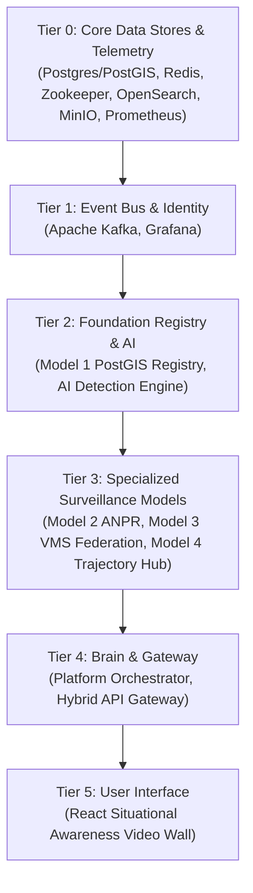

# Gujarat Sentinel — Complete Platform Execution & Operations Guide

This guide provides the official instructions for preparing, running, monitoring, testing, and stopping the **Gujarat Sentinel CCTV Hybrid Surveillance Platform** for the Gujarat Police Innovation Challenge 2026.

---

## 1. Quickstart — One Command Startup

### Linux / Kali Linux:
```bash
./run.sh
```

### Windows (PowerShell):
```powershell
.\run.ps1
```

### Cross-Platform Canonical Runner:
```bash
python scripts/run.py
```

### Non-Interactive / CI Mode:
```bash
python scripts/run.py --ci
```

---

## 2. CLI Command Reference

| Command | Purpose |
|---|---|
| `./run.sh` (or `.\run.ps1`) | Interactive menu (TTY) or full stack launch |
| `python scripts/run.py --start` | Launch full stack in topological order |
| `python scripts/run.py --status` | Display live ASCII health table of all 18+ components |
| `python scripts/run.py --doctor` | Full diagnostic environment & hardware inspection |
| `python scripts/run.py --check-ports` | Scan for port collisions across all services |
| `python scripts/run.py --verify` | Execute end-to-end multi-service health and smoke test |
| `python scripts/run.py --test` | Run all automated test suites |
| `python scripts/run.py --migrate` | Run database migrations (Alembic / PostGIS) |
| `python scripts/run.py --backend-only` | Launch only backend services and databases |
| `python scripts/run.py --frontend-only` | Launch only React Situational Awareness Video Wall |
| `python scripts/run.py --infra-only` | Launch only core infrastructure (PostgreSQL, Kafka, Redis, etc.) |
| `python scripts/run.py --ai-only` | Launch only AI Computer Vision & ANPR Engine |
| `python scripts/run.py --service model1` | Start specific service and its dependencies |
| `python scripts/run.py --stop` | Gracefully stop application processes |
| `python scripts/run.py --stop-all` | Gracefully stop application processes + Docker infrastructure |
| `python scripts/run.py --restart` | Restart all application services |
| `python scripts/run.py --restart model2`| Restart a specific service |

---

## 3. System Architecture & Startup Order

The runner executes services in strict topological dependency tiers:



---

## 4. Environment & Pre-requisites

Run the built-in diagnostic doctor to verify toolchains and hardware:

```bash
python scripts/run.py --doctor
```

**Required Tools:**
- **Python**: 3.11+ (Required)
- **Docker & Compose**: 2.20+ (Required for infrastructure)
- **Node.js**: v18+ (Required for frontend)
- **Go**: 1.22+ (For standalone Model 4 / Hybrid Gateway builds)
- **Java & Maven**: Java 17/21 + Maven 3.9+ (For standalone Model 3 build)
- **NVIDIA GPU / CUDA**: Optional (Automatic CPU fallback supported if GPU is unavailable)

---

## 5. Live Service Access Points

When running, the following endpoints are accessible:

| Service / Subsystem | Local URL | Description |
|---|---|---|
| **👑 Police Command Center UI** | `http://localhost:3001` | React Video Wall, GIS Map, Live ANPR Triage |
| **🌐 Central Brain Orchestrator** | `http://localhost:8005/docs` | FastAPI Brain, Officer Auth, Section 65B HMAC |
| **⚡ Hybrid API Gateway** | `http://localhost:8000` | Go Reverse Proxy routing live video, ANPR, metadata |
| **🗺️ Model 1 — CCTV Registry** | `http://localhost:8001/docs` | PostGIS spatial queries, GIS heatmaps |
| **📹 Model 2 — Unified Viewer** | `http://localhost:8002/docs` | PyAV video ingestion, YOLOv8 object detection, PaddleOCR |
| **🔌 Model 3 — VMS Federation** | `http://localhost:8003/actuator/health` | Java Spring Boot Hikvision/Dahua adapters |
| **🛣️ Model 4 — Trajectory Hub** | `http://localhost:8004/health` | Go multi-camera route tracking, MinIO video store |
| **🤖 AI Computer Vision Engine** | `http://localhost:8006/docs` | YOLO11 + ByteTrack + PaddleOCR microservice |
| **📊 Grafana SRE Dashboards** | `http://localhost:3000` | 4 SOC command dashboards (admin/grafana_admin_pass) |
| **📦 MinIO S3 Object Storage** | `http://localhost:9005` | S3 Video clips console (User: minioadmin / Pass: minioadmin) |
| **🔍 OpenSearch Dashboards** | `http://localhost:5601` | Log aggregation & forensic audit search |

---

## 6. Real-Data Assurance Policy

In accordance with Gujarat Police Hackathon standards:
- **`DATA_MODE=real`** is strictly enforced.
- The runner will refuse to populate screens with synthetic, mock, or fake operational data.
- Live video streams connect to configured RTSP endpoints (`live.corp8.cloud:8554`).
- Detections and speed metrics are computed deterministically from real video frames and PostGIS coordinates.

---

## 7. Process & Log Management

All runtime artifacts are cleanly stored under `runtime/`:
- `runtime/pids/<service>.pid`: Active process IDs for graceful termination.
- `runtime/logs/<service>.log`: Individual service stdout and stderr logs.
- `runtime/state.json`: Active run state metadata.

To view logs:
```bash
python scripts/run.py --logs
# Or view a specific service:
python scripts/run.py --logs model1
```

To stop all application services:
```bash
python scripts/run.py --stop
```
