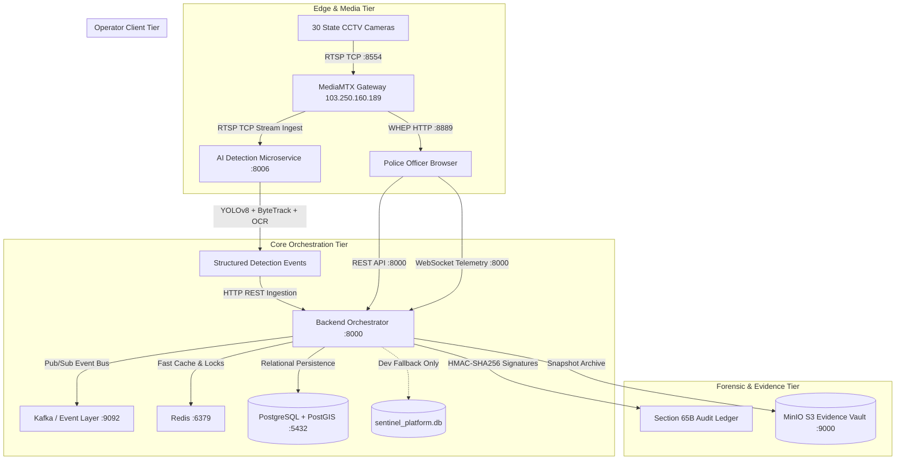

# Gujarat Sentinel-Hybrid: Actual Runtime Architecture

**Document Version**: 1.0.0 (Hardened Baseline)  
**Classification**: Authoritative Engineering Reference  
**Last Updated**: 2026-09-04  

---

## 1. Architectural Overview

Gujarat Sentinel-Hybrid is architected as an event-driven, hybrid surveillance intelligence platform designed for municipal and state-level CCTV networks. The runtime platform decouples real-time video stream ingestion from heavy asynchronous computer vision inference, evidence storage, and police operator workflows.

---

## 2. Ingestion & Video Plane

- **Live Gateway Host**: `103.250.160.189`
- **Protocols Supported**:
  - **RTSP (TCP)**: Port `:8554` (`rtsp://103.250.160.189:8554/stream/{cam_id}`). Used for server-to-server video consumption by OpenCV, FFmpeg, and `ai-detection`.
  - **WHEP (WebRTC)**: Port `:8889` (`http://103.250.160.189:8889/stream/{cam_id}/whep`). Provides sub-second real-time playback directly to WebRTC-capable web browsers via SDP offer/answer negotiation.
  - **HLS**: Configured on edge delivery for legacy/mobile playback fallback.
- **Authentication**: All endpoints enforce HTTP Basic / RTSP digest authentication using credentials injected at runtime (`SENTINEL_STREAM_USER`, `SENTINEL_STREAM_PASSWORD`).
- **Codec Profile**:
  - 24 Cameras: `H.264 / 90000` (Directly playable in all standard browsers).
  - 6 Cameras: `H.265 (HEVC) / 90000` (`cam06`, `cam12`, `cam17`, `cam18`, `cam22`, `cam26`).

---

## 3. Computer Vision & Analytics Plane

- **Microservice**: `ai-detection` (`port 8006`).
- **Pipeline Stages**:
  1. **Frame Capture**: OpenCV `VideoCapture` reads uncompressed frames via TCP RTSP with monotonic presentation timestamp (`POS_MSEC`).
  2. **Vehicle & Pedestrian Detection**: Ultralytics YOLOv8 nano (`yolov8n.pt`) detects vehicles (`car`, `truck`, `bus`, `motorcycle`) and pedestrians (`person`).
  3. **Multi-Object Tracking**: ByteTrack assigns persistent numeric track IDs (`track_id`) using spatial bounding box association and Kalman filters.
  4. **Plate Localization**: License plate ROI extraction based on vehicle bounding box lower quadrant.
  5. **Optical Character Recognition (ANPR)**: EasyOCR / PaddleOCR extracts alphanumeric registration characters.
  6. **Optical Unreadable Guard**: When characters fail optical recognition confidence (<0.50) due to distance or blur, the system truthfully records `UNREADABLE-TRACK-{id}` rather than hallucinating plates.

---

## 4. Orchestration & Business Logic Plane

- **Microservice**: `backend-orchestrator` (`port 8000`).
- **Core Functions**:
  - Authoritative Camera Catalogue & GIS metadata service.
  - Officer Badge Authentication (`JWT` tokens with role-based access control: Super Admin, Inspector, Patrol Officer, Auditor).
  - Break-glass emergency overrides with mandatory justification logging.
  - Dynamic 360° Vehicle Dossier compilation: aggregates all camera sightings for a target plate.
  - Case Management: Dossiers with dynamic verified node count (`COUNT(DISTINCT camera_id)`).
  - Section 65B Certificate Generation: Cryptographic HMAC-SHA256 signature chain across evidence frames, timestamps, and operator identity.

---

## 5. Storage & Persistence Architecture

- **Primary Database**: PostgreSQL 16 with PostGIS extension for spatial queries.
- **Development/Fallback Database**: SQLite (`sentinel_platform.db`), activated only when PostgreSQL port 5432 is unreachable during local developer runs.
- **Cache & Pub/Sub**: Redis for camera status caching (TTL 30s) and WebSocket broadcast channels.
- **Search Engine**: OpenSearch for full-text plate searches and fuzzy match queries.
- **Evidence Storage**: MinIO S3 object storage for long-term retention of raw evidence frames and Section 65B PDF certificates.
