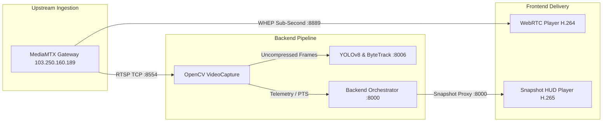

# Gujarat Sentinel-Hybrid: Media Plane Architecture

**Classification**: Core Architecture Document  
**Target Systems**: MediaMTX, `ai-detection`, `backend-orchestrator`, `frontend`  
**Last Updated**: 2026-09-04  

---

## 1. Media Plane Topology

The Sentinel-Hybrid media plane bridges high-bandwidth camera streams from the MediaMTX gateway to both backend neural inference workers and police officer web browsers.

---

## 2. Protocol Specifications & Transports

### Transport A: RTSP / RTP over TCP
- **Primary Endpoint**: `rtsp://103.250.160.189:8554/stream/{cam_id}`
- **Signaling**: RTSP 1.0 (DESCRIBE, SETUP, PLAY)
- **Transport**: Interleaved TCP (avoids UDP packet loss across state WAN networks)
- **Authentication**: RTSP Digest / Basic Authentication (`SENTINEL_STREAM_USER`, `SENTINEL_STREAM_PASSWORD`)
- **Consumer**: `ai-detection` (:8006) and `backend-orchestrator` diagnostic probe
- **Latency**: End-to-end decode latency ~150–250 ms once connected.
- **Failover / Reconnection**: Exponential backoff (1s, 2s, 4s, up to 30s max delay) with bounded frame buffers (`CAP_PROP_BUFFERSIZE = 1`) to eliminate drift.

### Transport B: WHEP (WebRTC HTTP Egress Protocol)
- **Primary Endpoint**: `http://103.250.160.189:8889/stream/{cam_id}/whep`
- **Signaling**: HTTP POST carrying SDP offer; gateway responds with SDP answer.
- **Media Transport**: SRTP over UDP (Port 8189) with ICE STUN candidate gathering.
- **Consumer**: Police surveillance dashboard `<LiveOperationsPage />` video wall.
- **Latency**: Sub-second (<300 ms glass-to-glass).
- **Security**: Authentication enforced via HTTP Basic Auth header.

### Transport C: Snapshot HUD Proxy
- **Endpoint**: `GET /api/v1/streams/{cam_id}/snapshot`
- **Purpose**: Low-bandwidth, high-reliability visualization fallback for mobile devices, low-connectivity rural police stations, and H.265 encoded streams.
- **Content**: JPEG image annotated with YOLO bounding boxes, vehicle classifications, and Section 65B watermark.

---

## 3. Codec Handling & Transcoding Matrix

| Camera Channels | Video Codec | Native WebRTC Browser Playback | Backend AI Ingest | Recommended Operational Transport |
|---|---|---|---|---|
| `cam01`–`cam05`, `cam07`–`cam11`, `cam13`–`cam16`, `cam19`–`cam21`, `cam23`–`cam25`, `cam27`–`cam30` (24 cameras) | `H.264 / AVC` | **Supported** (Chrome, Firefox, Safari, Edge) | **Supported** | WHEP Direct Stream (`:8889`) |
| `cam06`, `cam12`, `cam17`, `cam18`, `cam22`, `cam26` (6 cameras) | `H.265 / HEVC` | **Unsupported** (Standard WebRTC lacks hardware decode) | **Supported** (OpenCV FFmpeg) | Snapshot HUD Proxy (`/snapshot`) or FFmpeg transcode |
