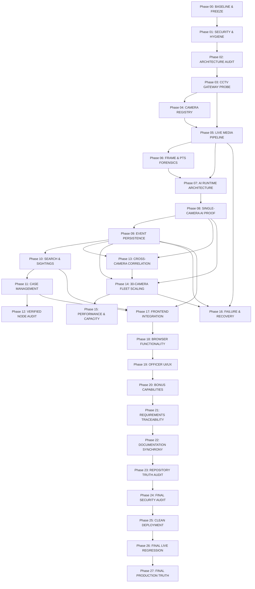

# Gujarat Sentinel-Hybrid: Phase Dependency Graph & Execution Model

**Document Version**: 1.0.0  
**Classification**: Authoritative Governance & AI Agent Execution Model  
**Last Updated**: 2026-09-04  

---

## 1. Master Phase Dependency Model

---

## 2. Hard Phase-Gating Rules

1. **RTSP Unreachable Rule**: If Phase 03 fails network or authentication on a stream, downstream AI ingestion (Phase 08) for that stream is strictly **BLOCKED**.
2. **Anti-Mock Database Rule**: Live operational persistence must never silently fall back to SQLite when PostgreSQL is the configured production target. SQLite is permitted solely for test/dev sandboxes.
3. **No-Hallucination ANPR Rule**: When character optical confidence is $<0.50$, the system must tag the plate as `UNREADABLE-TRACK-{id}` rather than inventing synthetic characters.
4. **Hardcoded Badge Rule**: Case dossiers must derive verified node counts strictly from `COUNT(DISTINCT camera_id)`; static constants are prohibited.
5. **Security Precedence Rule**: An unredacted credential immediately suspends current engineering and triggers regression back to Phase 01.

---

## 3. Registered Exceptions Handled in Dependency Flow

- `EX-001` (Direct WHEP vs Proxy): Handled between Phase 05 and Phase 17 via `/api/v1/streams/{id}/whep`.
- `EX-002` (H.265 WebRTC Browser Limitation): Handled between Phase 05 and Phase 18 via Snapshot HUD proxy.
- `EX-003` (Decoder PTS Semantics): Clarified between Phase 06 and Phase 11.
- `EX-004` (Uncaptured Live Multi-Camera Transit): Classified as `IMPLEMENTED + NOT VERIFIED IN LIVE RE-ID` in Phase 13.
- `EX-005` (Single-GPU Fleet Capacity): Bounded at 12–15 streams at 2 FPS in Phase 14 & 15.
