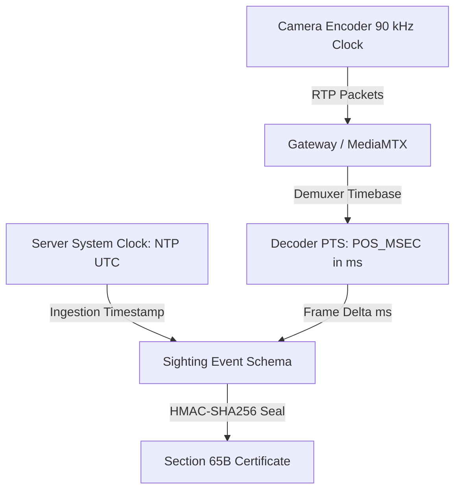

# Gujarat Sentinel-Hybrid: Time and Timestamp Architectural Model

**Classification**: Authoritative Engineering Model  
**Target Subsystems**: `backend-orchestrator`, `ai-detection`, `backend-model4`  
**Last Updated**: 2026-09-04  

---

## 1. Multi-Clock Architecture

In distributed CCTV surveillance, three separate clock domains exist simultaneously:
1. **Camera Sensor & RTP Clock**: 90 kHz frequency defined by RFC 3550/RFC 6184.
2. **Decoder Timeline**: Monotonic millisecond presentation timeline (`cv2.CAP_PROP_POS_MSEC`).
3. **Platform Server Clock**: Synchronized via Network Time Protocol (NTP) to UTC.

---

## 2. Technical Specifications of Timestamp Fields

| Field Name | Type | Unit | Clock Domain | Monotonic? | Purpose |
|---|---|---|---|---|---|
| `timestamp` | ISO-8601 String | UTC ($10^{-3}$ s) | Server NTP Clock | Yes | Cross-camera sorting, external chronological search |
| `pts_ms` / `pos_msec` | Float | Milliseconds | Demuxer / Decoder Stream | Strictly Monotonic | Intra-stream frame delta calculation ($\Delta t$), velocity estimation |
| `frame_id` / `frame_idx` | Integer | Counter | Ingestion Worker | Strictly Monotonic | Sequence order and dropped frame detection |
| `evidence_hash` | Hex String | 256 bits | Cryptographic SHA-256 | N/A | Immutable pixel payload verification |

---

## 3. Speed & Velocity Calculation Formula

When a vehicle track spans two consecutive sightings or frames within the same camera or between adjacent calibrated cameras:

$$\text{Velocity} (v) = \frac{\Delta \text{Distance (meters)}}{\Delta \text{Time (seconds)}} = \frac{D_{\text{spatial}}}{(t_2 - t_1)}$$

- For intra-camera tracking: $\Delta t = \frac{\text{pos\_msec}_2 - \text{pos\_msec}_1}{1000.0}$
- For inter-camera tracking: $\Delta t = \text{epoch\_seconds}_2 - \text{epoch\_seconds}_1$

---

## 4. Known Technical Limitations & Constraints

1. **Decoder Reset on Reconnect**: If an RTSP socket disconnects and re-establishes, `cv2.CAP_PROP_POS_MSEC` resets to near zero. The backend must always pair `pos_msec` with the active session UUID.
2. **Clock Drift**: Unsynchronized edge cameras without active NTP clients may exhibit internal clock drift. The platform therefore enforces server-side ingestion UTC timestamps for statewide correlation.
