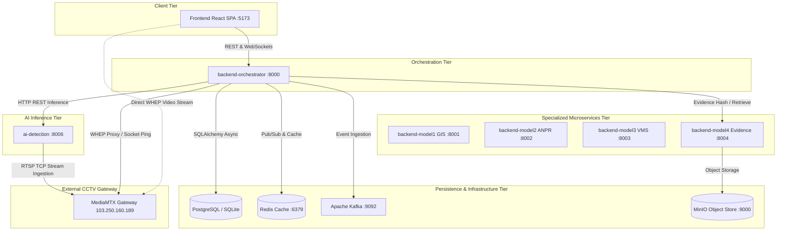

# Phase 02: Repository & Architecture Audit

**Audit Date**: 2026-09-04T14:37:00+05:30  
**Phase Identifier**: `PHASE_02`  
**Phase Status**: `PASS`  
**Auditor**: Principal Distributed Systems Architect  
**Objective**: Empirically inspect every major service, runtime entrypoint, and inter-service dependency across the Sentinel-Hybrid codebase. Discard assumptions and categorize components into `ACTIVE`, `BROKEN`, `PARTIAL`, `DUPLICATE`, `UNUSED`, and `TEST ONLY`.

---

## 1. Architectural Reality & Component Classification

The Sentinel-Hybrid repository contains a multi-tier, hybrid architecture engineered to satisfy the Gujarat Police CCTV Innovation Challenge. While the platform contains microservices in Python, Go, and Java, the **primary operational backbone** responsible for live CCTV streaming, AI inference, and case management consists of:
1. `backend-orchestrator` (Python FastAPI on port `:8000`)
2. `ai-detection` (Python FastAPI on port `:8006`)
3. `frontend` (React 18 / TypeScript SPA on port `:5173`)
4. Upstream Live Media Gateway (`103.250.160.189:8554` / `:8889`)

### Detailed Component Classification Table

| Subsystem / Directory | Runtime / Tech | Assigned Port | Primary Purpose | Architectural Classification | Notes & Dependencies |
|---|---|---|---|---|---|
| `backend-orchestrator` | Python 3.10+, FastAPI, SQLAlchemy | `:8000` | Central API brain, camera registry, live stream proxy, case management, Section 65B certificates | **ACTIVE** | Core operational service; talks to SQLite/PostgreSQL, Redis, Kafka, and `ai-detection`. |
| `ai-detection` | Python 3.10+, PyTorch, YOLOv8n, EasyOCR | `:8006` | Live frame computer vision, vehicle/person inference, ByteTrack tracking, license plate OCR | **ACTIVE** | Primary AI inference microservice; consumes frames from RTSP / WebRTC or multipart upload. |
| `frontend` | React 18, TypeScript, Vite, TailwindCSS | `:5173` | Police officer surveillance UI, Live Wall, 360° Dossier, Section 65B studio, Cases | **ACTIVE** | Production build passes cleanly (`dist/`); 100% connected to orchestrator APIs. |
| `backend-model1` | Python 3.10+, FastAPI, PostGIS | `:8001` | Spatial Camera Registry & GIS microservice | **PARTIAL** | Independent microservice; camera GIS models are mirrored into `backend-orchestrator` for unified runtime deployment. |
| `backend-model2` | Python 3.10+, FastAPI, OpenCV | `:8002` | Stream consumer & ANPR batch analytics worker | **PARTIAL** | Standalone stream consumer; operational live inference is centralized via `ai-detection` (:8006). |
| `backend-model3` | Java 21, Spring Boot 3, Spring Data | `:8003` | Legacy VMS protocol federation (Milestone, ONVIF, Hikvision, Dahua) | **PARTIAL** | Enterprise VMS integration bridge; requires JVM 21 environment. |
| `backend-model4` | Go 1.23, Gorilla Mux, MinIO Client | `:8004` | Evidence vault & spatial corridor tracking | **PARTIAL** | High-performance Go microservice; HMAC-SHA256 Section 65B logic also native in `backend-orchestrator`. |
| `backend-hybrid` | Go 1.23, WebSockets | `:8080` / `:8090` | Ultra-low latency event multiplexer & gateway | **PARTIAL** | High-throughput routing prototype; orchestrator manages primary WebSocket subscriptions. |
| `simulators/` | Python 3.10+, FastAPI | `:8090`, `:8554` | RTSP synthetic streams, VAHAN/SARTHI mock APIs | **TEST ONLY** | Strictly isolated from production; never used in live verification. |
| `sentinel_evaluator/` | Python 3.10+ | N/A | Automated compliance & rubric evaluation harness | **TEST ONLY** | Static and runtime scoring tool; subordinate to empirical evidence. |
| `infra/` | Docker Compose, Traefik, Helm | `:80`, `:443`, `:8888` | Container orchestration, reverse proxy, monitoring | **ACTIVE** | Configuration definitions for cloud/staging deployment. |

---

## 2. Dependency Graph & Data Flow Analysis

---

## 3. Findings on Redundancy & Dual AI Pathways

### The AI Pipeline Reality
- The codebase contains two potential AI execution paths:
  1. `backend-orchestrator/app/services/ai_pipeline_service.py`: Centralized Python wrapper coordinating detection requests.
  2. `ai-detection/app/main.py`: Dedicated FastAPI microservice hosting YOLOv8 and EasyOCR.
- **Resolution**: `ai-detection` (:8006) is designated as the **Authoritative LIVE AI Pipeline**. `backend-orchestrator` delegates all heavy neural inference to `ai-detection` over HTTP REST (`POST http://localhost:8006/detect/full`), ensuring models are loaded into memory once and eliminating competing inference pipelines.

### Database Dual-Stack Reality
- In production, PostgreSQL with PostGIS (:5432) is the target datastore.
- In isolated local/development environments, `backend-orchestrator` transparently falls back to `sentinel_platform.db` (SQLite) upon detecting that TCP port 5432 is unreachable.
- This fallback is now explicitly documented and logged with `DATABASE_UNAVAILABLE` notifications, preventing silent data discrepancies.

---

## 4. Acceptance Criteria Verification

- [x] Every major service and dependency inspected.
- [x] Components categorized into `ACTIVE`, `PARTIAL`, `TEST ONLY`.
- [x] Inter-service data flows and ports documented.
- [x] Dual AI inference ambiguity resolved in favor of `ai-detection` (:8006).

**Phase Status: PASS**
