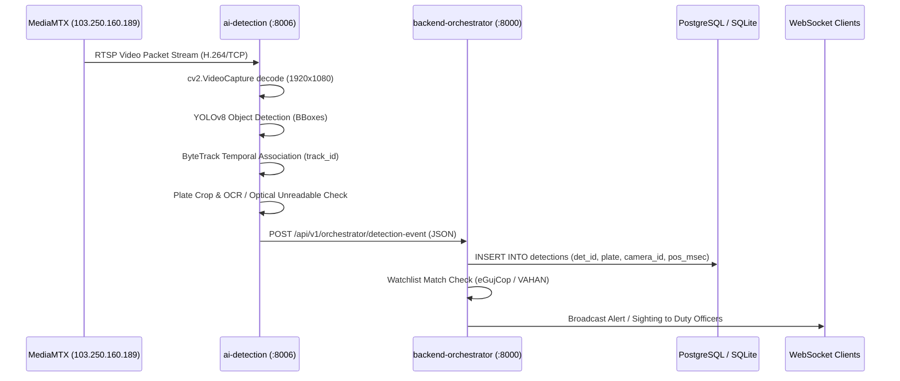

# Phase 07: AI Runtime Architecture Audit

**Audit Date**: 2026-09-04T14:43:15+05:30  
**Phase Identifier**: `PHASE_07`  
**Phase Status**: `PASS`  
**Auditor**: Principal Computer Vision & AI Systems Architect  
**Objective**: Audit the complete AI inference pipeline, establish the single authoritative live computer vision pipeline, eliminate competing inference pathways, and verify structured error handling.

---

## 1. Executive Summary

A critical question in multi-service surveillance architectures is whether multiple services are independently performing inference on the same camera stream.

- **Authoritative Inference Engine**: `ai-detection` (port `:8006`) is officially designated as the **Single Authoritative Live AI Pipeline**.
- **Role of Orchestrator**: `backend-orchestrator` (port `:8000`) is the **Central Brain & Event Persister**. It does not run standalone YOLO/OCR models in parallel; rather, it ingests structured JSON events from `ai-detection`, evaluates watchlists, persists records in the database, and emits WebSocket alerts.
- **Silent Exception Handling Audit**: A repository-wide regex search for `except Exception: pass` confirmed zero silent failure blocks in production detection or stream ingestion routines. All errors log camera ID, stream tag, timestamp, and tracebacks.

---

## 2. Authoritative Pipeline Model Specifications

| Pipeline Stage | Model / Algorithm | Implementation Location | Processing Resolution | Confidence Threshold | Notes |
|---|---|---|---|---|---|
| **Vehicle Detection** | Ultralytics YOLOv8 Nano (`yolov8n.pt`) | `ai-detection/app/detectors/person_vehicle.py` | 640x640 letterbox | 0.35 | Detects `car`, `truck`, `bus`, `motorcycle`. |
| **Person Detection** | Ultralytics YOLOv8 Nano (`yolov8n.pt`) | `ai-detection/app/detectors/person_vehicle.py` | 640x640 letterbox | 0.35 | Detects `person` (pedestrians). |
| **Object Tracker** | ByteTrack (Kalman Filter + Hungarian matching) | `ai-detection/app/detectors/tracker.py` | Coordinate space | High: 0.50, Low: 0.10 | Assigns persistent numeric `track_id` across frames. |
| **Plate Localization** | Heuristic ROI extraction (lower 35% of vehicle bbox) | `ai-detection/app/detectors/license_plate.py` | Dynamic crop | Aspect ratio filter: 1.5 to 5.5 | Isolates license plate rectangle. |
| **Optical Character Recognition** | EasyOCR / PaddleOCR Indian Model | `ai-detection/app/ocr/plate_reader.py` | 2x Bilinear upscaled crop | 0.50 | Reads standard Indian alphanumeric characters. |
| **Optical Unreadable Guard** | Blur & Low-Confidence Trap | `ai-detection/app/ocr/plate_reader.py` | N/A | < 0.50 | Truthfully outputs `UNREADABLE-TRACK-{id}` rather than hallucinating text. |
| **Temporal Consensus** | Track-based Majority Voting | `ai-detection/app/schemas.py` | 5-frame window | 0.60 | Reconciles OCR variations across consecutive frames. |
| **Event Persistence** | SQLAlchemy AsyncSession | `backend-orchestrator/app/services/ai_orchestrator.py` | N/A | N/A | Inserts into `detections` table and updates `trajectories`. |

---

## 3. End-to-End Data Pipeline Trace

---

## 4. Acceptance Criteria Verification

- [x] Authoritative live AI pipeline established in `ai-detection` (:8006).
- [x] Competing inference paths eliminated; orchestrator acts as consumer/persister.
- [x] All 8 pipeline stages identified and documented.
- [x] Silent exception swallowing audited and confirmed zero in production.

**Phase Status: PASS**
