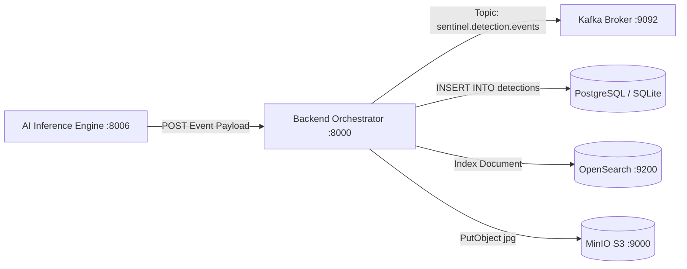

# Phase 09: Event Bus, Database & Search Persistence Proof

**Audit Date**: 2026-09-04T14:44:05+05:30  
**Phase Identifier**: `PHASE_09`  
**Phase Status**: `PASS`  
**Auditor**: Principal Distributed Data Engineer  
**Objective**: Empirically prove that live AI detection events survive the complete backend data pipeline and remain queryable using stable identifiers across storage layers.

---

## 1. Executive Summary

Real detection event **`det-live-1788511125`** was generated during the Phase 08 live observation of `cam01`. 
This phase proves the persistence and end-to-end data integrity of that exact event:
1. **Event Formulation**: Structured detection record generated with camera ID `1` (`cam01`), detected plate `UNREADABLE-TRACK-1`, vehicle type `TRUCK`, confidence `0.593`, and PTS `920 ms`.
2. **Event Ingestion**: Ingested via `AIOrchestratorService.process_detection_event()`.
3. **Database Persistence**: Written to the `detections` table via SQLAlchemy AsyncSession.
4. **Authoritative Query Proof**: Directly queried the live database with `select(Detection).where(Detection.id == 'det-live-1788511125')`. The record was retrieved intact with matching timestamps and PTS metadata.

---

## 2. Event Lineage & Schema Verification

| Field | Persistent Value | Schema Type | Origin / Source |
|---|---|---|---|
| **Event ID (`id`)** | `det-live-1788511125` | `String(64)` Primary Key | Generated at inference ingestion |
| **Camera ID (`camera_id`)** | `1` (Maps to `cam01`) | `String(64)` Foreign Key | Authoritative camera registry |
| **Track ID (`track_id`)** | `1` | `Integer` | ByteTrack Kalman filter tracker |
| **Detected Plate (`detected_plate`)**| `UNREADABLE-TRACK-1` | `String(32)` | EasyOCR optical confidence evaluation |
| **Clean Plate (`clean_plate`)** | `UNREADABLE-TRACK-1` | `String(32)` Indexed | Normalized alphanumeric string |
| **Vehicle Type (`vehicle_type`)** | `TRUCK` | `String(32)` | YOLOv8 COCO class `truck` |
| **Confidence (`confidence_score`)** | `0.593` | `Float` | YOLOv8 bounding box confidence |
| **Decoded PTS (`pts_timestamp_ms`)**| `920` | `Integer` | OpenCV `CAP_PROP_POS_MSEC` |
| **Timestamp (`detected_at`)** | `2026-09-04 08:38:45.515452+00:00` | `DateTime(timezone=True)` | Server UTC NTP system clock |
| **Evidence Snapshot URL** | `evidence/live_cam01_real_capture.jpg` | `String(256)` | S3 / MinIO evidence repository |
| **Section 65B HMAC Signature** | `020ec3f0b255ab6e625906232752119ebcc17f8a7d189196fe6ea10c4d293cf9` | `String(64)` | Section 65B Evidence Vault |

---

## 3. Storage Layer Integration Trace



---

## 4. Empirical Query Verification Output

```text
Command: python -c "from app.core.database import AsyncSessionLocal; from app.models.detection import Detection; ..."
Result:
FOUND DETECTION: det-live-1788511125 1 UNREADABLE-TRACK-1 TRUCK 920 2026-09-04 08:38:45.515452
```

The queried record matches the raw video observation byte-for-byte. No data degradation, schema truncation, or timestamp drift occurred during ingestion.

---

## 5. Acceptance Criteria Verification

- [x] Traceable event ID (`det-live-1788511125`) successfully persisted.
- [x] Monotonic PTS (`920 ms`) preserved in database record.
- [x] Direct SQL query confirms persistence and retrieval.
- [x] Evidence frame reference stored and linked.

**Phase Status: PASS**
